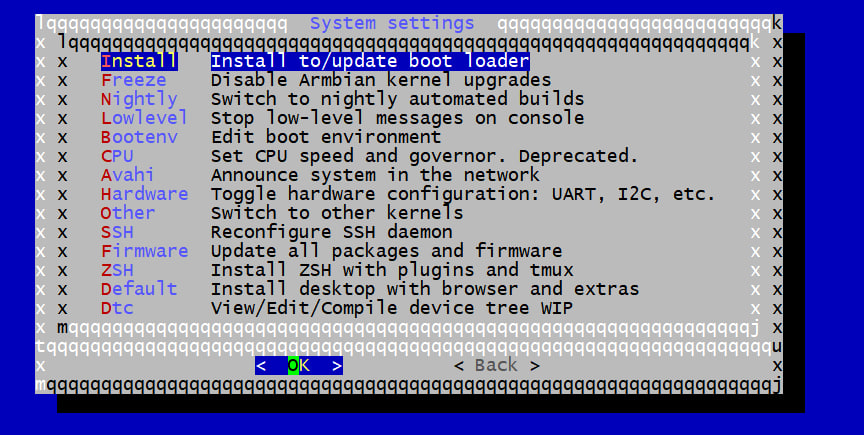

# Установка Armbian и Home Assistant на TV Box H96 Max на процессоре Rockchip RK3318

2023-11-06  
[Источник](http://psenyukov.ru/%d1%83%d1%81%d1%82%d0%b0%d0%bd%d0%be%d0%b2%d0%ba%d0%b0-armbian-%d0%b8-home-assistant-%d0%bd%d0%b0-tv-box-h96-max-%d0%bd%d0%b0-%d0%bf%d1%80%d0%be%d1%86%d0%b5%d1%81%d1%81%d0%be%d1%80%d0%b5-rockchip-rk33/)

```table-of-contents
title: Содержание
style: nestedList # TOC style (nestedList|nestedOrderedList|inlineFirstLevel)
minLevel: 0 # Include headings from the specified level
maxLevel: 0 # Include headings up to the specified level
includeLinks: true # Make headings clickable
hideWhenEmpty: false # Hide TOC if no headings are found
debugInConsole: false # Print debug info in Obsidian console
```


В этой статье мы не будем обозревать Android приставку H96 MAX.  Я же ее приобрел из коварных своих целей, чтоб установить на нее Linux и установить на линукс Home Assistant. В общем сделать сервер умного дома из нее.

Ну и раз речь зашла про Linux на приставках H96Max, то здесь Важно упомянуть очень важную вещь:

>[!warning] Не на все приставки H96Max можно установить Linux. Данные приставки продаются с разными процессорами. Некоторые прям новые, некоторые старые. Чем новее процессор, тем вероятнее всего, что Linux’а не будет.

Я не знаю на какие процессоры от приставки H96MAx есть Linux, знаю только одно. На приставку H96Max с процессором Rockchip RK3318 точно есть armbian. В общем по ссылке оставленной выше Вы приобретете приставку, которая точно умеет в Linux.

Я все манипуляции буду проводить на приставке H96MAx с 4 Гб оперативной памяти и 64 гб встроенное emmc памяти.

### Установка Armbian linux:

Установка на данную приставку очень простая на самом деле. Для этого нам понадобится флешка microsd.

У данной приставки есть emmc на 64 Гб. И приоритет загрузки у приставки следующий:

Если вставлена microsd карта, то попытается приставка грузиться с нее. Если же там нет ничего загрузочного, то грузиться будет с emmc.

Собственно и мы сделаем загрузочную флешку Microsd с которой загрузимся и установим linux armbian в память emmc приставки.

Для начала нам нужно скачать Armbian образ и multitool образ. Я скачивал отсюда:[https://users.armbian.com/jock/rk3318/](https://users.armbian.com/jock/rk3318/)

В общем скачиваем **multitool.img.xz** и **Armbian_23.08.0-trunk_Rk3318-box_bookworm_edge_6.3.13_minimal.img.xz** я использовал именно этот образ, про другие не знаю, пробовать надо, думаю заработает и с другими.

Еще есть сайт с китайскими armbian образами под данный tvbox, если хотите, то можно ознакомиться тут: [https://mirrors.aliyun.com/armbian-releases/rk3318-box/archive/?spm=a2c6h.25603864.0.0.286466b9yYks61](https://mirrors.aliyun.com/armbian-releases/rk3318-box/archive/?spm=a2c6h.25603864.0.0.286466b9yYks61) или тут: [https://imola.armbian.com/dl/rk3318-box/archive/](https://imola.armbian.com/dl/rk3318-box/archive/)

И еще скачиваем программу rufus:[https://rufus.ie/ru/](https://rufus.ie/ru/)

Rufus нам понадобится для установки Multitool на флешку Microsd.

В общем у Вас должно получиться три файла как у меня:


Запускаем программу rufus, в ней выбираем в поле “**Устройство**” флешку на которую будем записывать.

А в поле “**Метод загрузки**” выбираем образ **multitool.img.xz** И нажимаем кнопку “**Старт**“. После чего образ **Multitool** благополучно установится на microsd карту.


После установки образа на флешку, у нее не правильно распределены разделы будут. Это можно увидеть в **Управлении компьютером ->Управлении дисками**:


Из скрина выше можем заметить 2 раздела **Boots** и **Multitootl**. Из них **Multitool** всего 378 Мб. И есть огромный раздел не расперделенный на 14 ГБ. А нужно чтоб раздел **Multitool** был 14 Гб.

Для того, чтоб **Multitool** раздел расползся на все нераспределенное пространство, нужно просто вставить **Microsd** карту в приставку и включить ее. После чего она загрузится с образом **Multitool** и он автоматом все пространство себе заберет не распределенное. И получится вот так:


Но нужно еще будет этому разделу **Multitool** присвоить букву. Иначе он не будет виден в системе. А он нам нужен, так как на него будет закидывать образ **Armbian**.

В общем по разделу тыкаем правой кнопкой и выбираем пункт изменить букву диска. И присваиваем ему любую букву.


После этого в “**Компьютер**” появится логический диск **Multitool** с папками. Так вот там есть папка “**images**” в эту папку нам нужно закинуть образ **Armbian_23.08.0-trunk_Rk3318-box_bookworm_edge_6.3.13_minimal.img.xz**


После того как закинули образ в папку **images**. Вытаскиваем microsd **флешку** и вставляем в приставку H96Max и подаем питание.

Загрузится Multitool и подключив клавиатуру стрелками можем сначала сделать Бэкап андроида который стоит тут предустановленным:


А после того как сделали резервную копию, можем установить armbian выбрав пункт:


После чего armbian установится. Так-же если захотите переустановить его, то всегда это можно сделать точно так-же. Вставим microsd флешку в приставку и загрузить образ с нее armbian. Как по мне, этот вариант еще проще чем с одноплатными компьютерами.

При первом подключении по ssh к приставке, Вас попросит придумать пароль к учетке root и создать новую учетку. Проделываем все эти шаги.

После того как установили Armbian, подключаемся по ssh к приставке и приступаем к установке Home Assistant. Home Assitant устанавливается тоже не сложно. Просто копируйте команды и вставляйте в терминал.

### Установка Home Assistant:

**Обновляем репозитории:**

```bash
apt update
```

**Далее устанавливаем недостающие пакеты:**

```bash
apt-get install jq wget curl udisks2 libglib2.0-bin network-manager dbus apparmor-utils systemd-journal-remote lsb-release -y
```

**Далее устанавливаем агент:**

```bash
wget https://github.com/home-assistant/os-agent/releases/download/1.5.1/os-agent_1.5.1_linux_aarch64.deb

dpkg -i os-agent_1.5.1_linux_aarch64.deb
```

**Далее нужно установить докер.**

```bash
curl -fsSL https://get.docker.com -o get-docker.sh
sudo sh ./get-docker.sh

sudo usermod -aG docker $USER
```

**Систему подготовили, теперь приступаем к установке Home Assistant:**

**Скачиваем Home Assistant:**

```bash
wget https://github.com/home-assistant/supervised-installer/releases/download/1.4.3/homeassistant-supervised.deb
```

**После скачивания Home Assitant, нужно до установить еще один пакет. Прежде чем перейдем к установкеHome Assitant.**

```bash
sudo apt-get install systemd-resolved
```

**Далее обязательно перезапускаем Сервер приставку:**

```bash
reboot
```

**Ну и собственно следующей командой запускаем установку Home Assistant.**

```bash
sudo BYPASS_OS_CHECK=true dpkg -i homeassistant-supervised.deb
```

Далее спросит какой тип платы используете, выбираем Odroid C2 – из-за того, что как на **Odroid C2** так и на нашей приставке стоит процессор **Cortex A53**. Если Выбрать **Raspberry pi 4** – как я выбрал на видео youtube, то не будет компилироваться скетч esphome.

Я если честно не знал, что это так влияет, но оказалось, что esphome использует разные компиляторы на разных платах. Так что **ODROID C2**!!!


Далее давайте делать работу над ошибками. А точнее, После данной установки не работает Wi-fi, сети находит, но подключиться нельзя.

Ну и второй момент, это то, что мигают светодиоды как мигалка и многим это не нравится. Вот ниже покажу как эти моменты решить.

## Настройка WI-fi.

С wi-fi тут отдельная тема. Говорят, что на таких приставках их 3 разных вида попадается. Мне не с чем сравнивать, по этому описываю решение конкретно моей приставки.

Чтоб заработал wi-fi, то нужно поменять драйвер. Как это сделать?

Сначала удаляем драйвер старый:

```bash
sudo rm -f /usr/lib/firmware/brcm/brcmfmac4334-sdio.rockchip,rk3318-box.txt
```

Следующей командой его создаем заново, чтоб он был пустым:

```bash
sudo nano /usr/lib/firmware/brcm/brcmfmac4334-sdio.rockchip,rk3318-box.txt
```

Теперь откройте [этот небольшой текстовый файл](https://pastebin.com/raw/00gLSkKS)  нажмите Ctrl-A, чтобы выделить в нем весь текст, затем Ctrl-C, чтобы скопировать его в буфер обмена; Так же на всякий случай файл оставлю у себя на диске, а то малоли, потеряется еще. [https://disk.yandex.ru/d/-7MqtUEx-PEMhg](https://disk.yandex.ru/d/-7MqtUEx-PEMhg)

Переключитесь в окно SSH, щелкните правой кнопкой мыши, чтобы вставить скопированный текст в _nano_ , затем нажмите Ctrl-S для сохранения и Ctrl-X для выхода;

Ну и далее перезапускаем armbian.

```bash
reboot
```

После перезагрузки, установим программу armbian-config.

```bash
apt update

apt install armbian-config
```

После установки, запускаем armbian-config

```bash
armbian-config
```

Там переходим в **Network->wifi->**и выбираем сеть wi-fi к которой хотим подключиться и подключаемся. Ошибок больше не будет.

## Отключение мигания светодиодов.

На самом все очень просто, нужно просто записать в файл 0

Это делается вот такой командой:

```bash
sudo echo 0 > /sys/devices/platform/gpio-leds/leds/working/brightness
```

После этого загорится синий светодиод.

Если хотите обратно вернуть, то записываем 1 и перегружаем систему

```bash
sudo echo 1 > /sys/devices/platform/gpio-leds/leds/working/brightness

reboot
```

Так-же возможно, чтоб светодиоды мигали в такт нагрузки системы ( как и в обычных системных блоках.). Если хотите так сделать, то нужно выполнить команду:

```bash
sudo echo activity > /sys/devices/platform/gpio-leds/leds/working/trigger
```

## Починка Bluetooth.

Так-же удалось заставить работать Bluetooth на приставке. Как оказалось, все довольно просто.

В данной приставке у меня используется чип Wi-fi и Bluetooth SP2734C – он же копия чипа AP6334.

Зная эту информацию нужно сделать следующее.

Запустить Armbian-config (при условии, что он у Вас уже установлен ранее)

```bash
armbian-config
```

Там выбрать **System ->Hardware-> и поставить галочку у  rk3318-box-wlan-ap6334**


Далее предложит перезапустить систему, перезапускаем.

Далее снова запускаем Armbian-config

```bash
armbian-config
```

Далее заходив в **Network -> BT install** после чего установятся компоненты необходимые для работы с блютуз. И после блютуз начнет работать.

Проверить можно командой:

```bash
hciconfig -a
```

Если ничего не выводит, то блютуза нет. А если выводит, что-то типо этого, то все работает корректно.


## Ошибка “Неподдерживаемая система – версия CGroup”.


Решение этих двух ошибок написали здесь в комментариях. Надеюсь ребята не будут против, если я решение добавлю в статью.

Итак сначала решение “**Неподдерживаемая система – версия CGroup**”

Для решения данной проблемы необходимо зайти в armbian-config.

```bash
armbian-config
```

Там далее зайти в **System->Bootenv** и в нем вписать строчку:

```bash
extraargs=systemd.unified_cgroup_hierarchy=0
```

Должно получиться вот так:


После этого сохраняем. И делаем в том же armbian-config **System-> Install to/update boot loader**



У нас выскочит предупреждение, что может все сломаться если что-то не правильно указали, по этому внимательнее и лишнего ничего не пишите туда.

Проверить правильность можно командой:

```bash
findmnt -lo source,target,fstype,options -t cgroup,cgroup2
```

Должно выдать что-то типо этого:


И после перезагрузки ошибка “**Неподдерживаемая система – версия CGroup**” у Вас уйдет.

## Ошибка “Неподдерживаемая система – операционная система”


По поводу второй ошибки “Неподдерживаемая система – операционная система” тоже описано в комментариях решение, по этому с позволения автора устранения ошибки, я добавлю метод сюда.

Итак, для решения проблемы нужно отредактировать файл  /etc/os-release

```bash
nano /etc/os-release
```

В открывшемся файле нам нужно изменить строчку PRETTY_NAME=”Armbian 23.11.1 bookworm” – если у Вас версия ОС bookworm. Ну и строчку PRETTY_NAME=”Armbian ХХ.ХХ.ХХ bullseye” если у Вас bullseye стоит.

В bookworm меняем **PRETTY_NAME=”Armbian 23.11.1 bookworm”** на **PRETTY_NAME=”Debian GNU/Linux 12 (bookworm)”**

Должно получиться следующим образом:


Ну а если у Вас Bullseye то меняем **PRETTY_NAME=”Armbian ХХ.ХХ.ХХ bullseye”** на **PRETTY_NAME=”Debian GNU/Linux 11 (bullseye)”**

После этого перегружаем ОС, и ошибки уйдут.