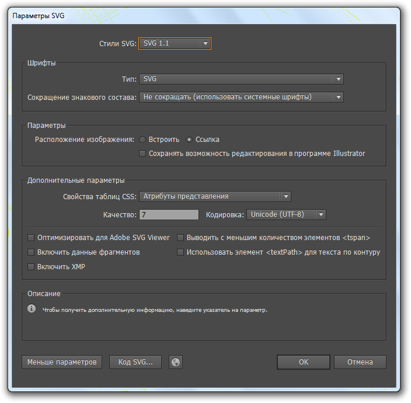

[SVG](http://www.w3.org/Graphics/SVG/) (от англ. Scalable Vector Graphics — масштабируемая векторная графика) — язык разметки масштабируемой векторной графики, созданный Консорциумом Всемирной паутины (W3C) и входящий в подмножество расширяемого языка разметки XML, предназначен для описания двумерной векторной и смешанной векторно/растровой графики в формате XML.  
#### Инструменты

  Принцип работы приложений заключается в следующем, они удаляют «ненужную» информацию из SVG, тем самым уменьшается размер самого файла. На сегодняшний день можно выделить три основных приложения для оптимизации SVG:  

- [SVG Cleaner](http://qt-apps.org/content/show.php/SVG+Cleaner?content=147974);
- [SVG Scour](https://github.com/terrcin/svg-scour) (для работы необходимо установить [Python](http://www.python.org/));
- [SVG Optimizer](https://github.com/svg/svgo) (для работы необходимо установить [Node.js](http://nodejs.org/)).

  #### Сравнение

  Для сравнения результатов приложений, я взял следующее [изображение](http://rghost.ru/47113149).  
  

  
Изображение сохранено с помощью Adobe Illustrator CS6.  
  
**Параметры SVG**

  
Размер изображения — **6 279 219 байт**  

| **Приложение**                        | **Результат, байт** | **Результат, %** | **Затраченное время, секунда** |
| ------------------------------------- | ------------------- | ---------------- | ------------------------------ |
| _SVG Scour 0.26-3_                    | 4 421 520           | 29,6%            | 205                            |
| _SVG Cleaner 0.5.1_                   | 3 727 883           | 40,6%            | 30                             |
| _SVG Optimizer 0.37_                  | 2 646 541           | 57,9%            | 15                             |
| _SVG Scour+SVG Cleaner+SVG Optimizer_ | 2 502 136           | 60,1%            | 240                            |
#### Заключение
1. Последовательное использование приложений помогает увеличить степь сжатия изображения.
2. SVG представляет собой текстовой файл XML, программы по оптимизации могут «испортить» изображения, т.е. браузеры не правильно отрисовывают изображение.
