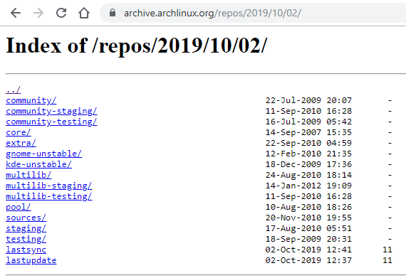

```table-of-contents
title: Содержание:
style: nestedList # TOC style (nestedList|inlineFirstLevel)
minLevel: 0 # Include headings from the specified level
maxLevel: 0 # Include headings up to the specified level
includeLinks: true # Make headings clickable
debugInConsole: false # Print debug info in Obsidian console
```
---
## Tomcat conf permission
```bash
sudo chmod -R 755 /usr/share/tomcat8/conf/
```

---
## yay пропуск проверки контрольной суммы

>используем следующие ключи
```bash
yay -Syu --mflags --skipinteg
```

---
## Принудительная перезапись пакета

используем  `--owerwrite "*"` для принудительного обновления пакета или полного обновления применимо как для pacman, так и для yay

>например:
```bash
sudo pacman -Syyuu --overwrite "*"
```

---
## Откат на предыдущую версию

>Обновление системы
```bash
sudo pacman -Syu
```

В качестве примера обновление пакета **mesa** (**19.2.0-2** -> 19.1.7-1) и **libglvnd** (**1.2.0-1** -> 1.1.1-1) стало вызывать ошибки.

Проверяем log файлы Xorg
```bash
grep /var/log/Xorg.0.log -e "EE" -e "WW"
```

>Видим ошибки:
```
(EE) 0: /usr/lib/Xorg (xorg_backtrace+0x4d) [0x55c3b478269d]
(EE) 1: /usr/lib/Xorg (0x55c3b46d0000+0xa8be8) [0x55c3b4778be8]
(EE) 2: /usr/lib/libc.so.6 (0x7f8657f5c000+0x3a7e0) [0x7f8657f967e0]
(EE) 3: /usr/lib/dri/i965_dri.so (0x7f8655b9e000+0x619f4e) [0x7f86561b7f4e]
(EE) 4: /usr/lib/dri/i965_dri.so (0x7f8655b9e000+0x61d3a4) [0x7f86561bb3a4]
(EE) 5: /usr/lib/dri/i965_dri.so (0x7f8655b9e000+0x111ca7) [0x7f8655cafca7]
(EE) 6: /usr/lib/dri/i965_dri.so (0x7f8655b9e000+0x1801ff) [0x7f8655d1e1ff]
(EE) 7: /usr/lib/xorg/modules/extensions/libglx.so (0x7f8656db0000+0x2dace) [0x7f8656dddace]
(EE) 8: /usr/lib/xorg/modules/extensions/libglx.so (0x7f8656db0000+0x11877) [0x7f8656dc1877]
(EE) 9: /usr/lib/Xorg (_CallCallbacks+0x34) [0x55c3b483d644]
(EE) 10: /usr/lib/Xorg (0x55c3b46d0000+0x9dc53) [0x55c3b476dc53]
(EE) 11: /usr/lib/Xorg (InitExtensions+0x89) [0x55c3b487a8b9]
(EE) 12: /usr/lib/Xorg (0x55c3b46d0000+0x37526) [0x55c3b4707526]
(EE) 13: /usr/lib/libc.so.6 (__libc_start_main+0xf3) [0x7f8657f82ee3]
(EE) 14: /usr/lib/Xorg (_start+0x2e) [0x55c3b47083be]

(EE) Floating point exception at address 0x7f86561b7f4e

Fatal server error:
(EE) Caught signal 8 (Floating point exception). Server aborting
```

Делаем откат на версии пакетов которые были в определенную дату, в данном случае на 2 октября.
Архив доступен по данной ссылке: [archive.archlinux.org](https://archive.archlinux.org/)

Выберем дату на которую хотим откатиться и копируем ссылку из браузера



>Теперь нам нужно отредактировать **mirrorlist** 
```bash
sudo nano /etc/pacman.d/mirrorlist
```

Комментируем существующие зеркала, добавляем ниже в нее ранее скопированную строку  

```
Server = https://archive.archlinux.org/repos/2019/10/02/$repo/os/$arch
```

>Приступаем к обновлению (откату системы):
```bash
sudo pacman -Syyuu
```

>После того как откатились эти “хорошие” пакеты нужно их добавить “так сказать” в “игнорлист”
```bash
sudo nano /etc/pacman.conf
```

Находим в конфигурационном файле строку **#IgnorePkg =**  раскомментируем и добавляем эти “бракованные” пакеты 
`IgnorePkg = mesa libglvnd`

Сохраняем, из **mirrorlist’a** удаляем или комментируем **Server** с архивом, и снова обновляем систему, но уже без **mesa и libglvnd**

---
## Сервер звука pipeware

Замена PulseAudio и ALSA на PipeWire
  
>Для решения проблемы с не работающим pulseeffects в Arch выполняем  
```bash
sudo pacman -Sy pipewire pipewire-alsa pipewire-pulse gst-plugin-pipewire
```  
После ввода pacman предупредит что будет удалён pulseaudio server (y/n)  

>После чего перезагрузить ПК. 
```
reboot
```
  
Если у нас установлен pipewire-alsa – bluetooth должен запускаться автомататически. C pulseaudio это было не так, там звук через bluetooth добавлялся модулем из отдельного пакета.  
  
Внимание! В процессе будет удалён pulseaudio и pulseaudio-bluetooth. Если для вас важны особенности кастомной настройки pulseaudio, а без них pipewire с pipewire-pulseaudio будет работать не так хорошо, как старый-добрый pulseaudio с кастомными настройками – вам лучше откатиться назад на pulseaudio.  
  
>Проверяем, что получилось  
```bash
pactl info
```
  
получаем примерный листинг  
```q
Server Name: PulseAudio (on PipeWire 0.3.21)  
Server Version: 14.0.0  
```
  
>Если после перехода на PipeWire у вас возникли задержки звука и искажения, необходимо открыть файл  
```bash
sudo nano /etc/pipewire/pipewire.conf
```

>и привести параметры  
```q
default.clock.quantum = 64  
default.clock.min-quantum = 32  
default.clock.max-quantum = 512  
```
к указанным выше значениям. Если не поможет, можно ещё уменьшить, при этом желательно указываться числа,  кратные 8.  

---
## AUR - исправления источника для недоступного ресурса

на примере liberica java 21
на территории РФ ресурсы bell-sw.com заблокированы, выдает ошибку 403
можно использовать VPN или изменить на другой, не заблокированный источник 

1. пытаемся установить liberica java 21
```bash
yay -S liberica-jdk-21-full-bin
```

2. получаем ошибку что файл недоступен
`curl: (22) The requested URL returned error: 403`
`ОШИБКА: Ошибка при загрузке 'https://download.bell-sw.com/java/21.0.2+14/bellsoft-jdk21.0.2+14-linux-amd64-full.tar.gz'`

3. открываем файл сборки
```bash
kate /home/user/.cache/yay/liberica-jdk-21-full-bin/PKGBUILD
```

4. находим строчку 
```ini
source_x86_64=(https://download.bell-sw.com/java/$_pkgver/bellsoft-jdk$_pkgver-linux-amd64-full.tar.gz)
```

5. заменяем на 
```ini
source_x86_64=(https://github.com/bell-sw/Liberica/releases/download/$_pkgver/bellsoft-jdk$_pkgver-linux-amd64-full.tar.gz)
```

6. собираем и устанавливаем
```bash
cd /home/user/.cache/yay/liberica-jdk-21-full-bin
makepkg -si
```

7. если по какой-то причине контрольные суммы не совпадают, то можно на свой страх и риск добавить ключ для игнорирования контрольных сумм
`--skipinteg`

---
## Игнорировать обновление pacman
```bash
sudo nano/etc/pacman.conf
```

>пример
```
IgnorePkg = vlc
```

---
## Микрокод процессора

>intel
```bash
sudo pacman -S intel-ucode
```

>AMD
```bash
sudo pacman -S amd-ucode
```

---
## Автоматическая очистка кэша пакетов

```bash
sudo pacman -S pacman-contrib
sudo systemctl enable paccache.timer
```

---
## Автоматическое резервное копирование перед обновлением пакетов
```bash
yay -S timeshift-autosnap
```

---
## Шрифты
```bash
sudo pacman -S noto-fonts noto-fonts-cjk noto-fonts-emoji ttf-liberation
```

---
## Зеркала
[Статья на wiki](https://wiki.archlinux.org/title/Mirrors_(%D0%A0%D1%83%D1%81%D1%81%D0%BA%D0%B8%D0%B9)

Делаем резервную копию `/etc/pacman.d/mirrorlist`, находим самые быстрые зеркала и сохраняем

```bash
sudo pacman -S pacman-contrib
sudo su

# при повторном ранжировании зеркал резевную копию делать не нужно, просто переходим к следующей команде
cp /etc/pacman.d/mirrorlist /etc/pacman.d/mirrorlist.bak

# команда может быть долгой, может показаться что терминал завис, просто ждите окончания
sudo rankmirrors -n 6 /etc/pacman.d/mirrorlist.bak > /etc/pacman.d/mirrorlist
exit
```

---
## arch a start job is running for /dev/tmprm0

```bash
systemctl mask dev-tpmrm0.device
```

---
## Принудительная переустановка всех пакетов

```bash
sudo pacman -Sdd $(pacman -Qnq)
```

---
## Удаление всех отладочных пакетов

```bash
sudo pacman -Rns $(pacman -Qq | grep '\-debug$')
```

---
## Не отображается значок java приложения в wayland в сессии KDE окружения

- достаточно указать переменную окружения `GDK_BACKEND=x11`, при наличии компонента `XWayland`
```bash
GDK_BACKEND=x11 java -jar your-application.jar
```

- компонент `XWayland`
```bash
sudo pacman -S xwaylandvideobridge
```

---
## Открыть от директорию в dolphin от root 
```bash
sudo pacman -S kio-admin
```

---
## Поддержка темных тем gnome 4 в KDE
```bash
yay -S gsettings-desktop-schemas
```

---
## Скрипт обновления системы через yay

- В поле `Программа` помещаем ссылку на скрипт  
- В поле `Аргументы` указываем пароль от root
- В `Дополнительных параметрах` выбираем `Выполнять в терминале`


```bash
#!/bin/bash

# Очищаем неудачные попытки входа
faillock --user $USER --reset

# Проверка наличия аргумента (пароля)
if [ -z "$1" ]; then
    echo "Ошибка: укажите пароль в качестве аргумента."
    echo "Использование: $0 <пароль>"
    exit 1
fi

PASSWORD="$1"

# Проверка наличия yay
if ! command -v yay &>/dev/null; then
    echo "Ошибка: yay не установлен. Установите его и попробуйте снова."
    exit 1
fi

# Кешируем sudo-пароль на 1 час (3600 секунд)
echo "$PASSWORD" | sudo -S true
(sleep 3600; sudo -K) &

# Запуск обновления через yay (без sudo)
echo "Начинается обновление системы..."
yay -Syudd --overwrite "*" --noconfirm

# Проверка успешности обновления
if [ $? -eq 0 ]; then
    notify-send "Обновление успешно завершено" --app-name="Обновление системы" --expire-time=5000 --icon=dialog-information
    echo "Обновление успешно завершено."
else
    notify-send "Обновление завершилось с ошибками" --app-name="Обновление системы" --expire-time=5000 --icon=dialog-error
    echo "Обновление завершилось с ошибками."
    exit 1
fi
```

---
## Отображение eng и rus вместо us и ru

>Откройте файл конфигурации `kdeglobals` или `kxkbrc`:
```bash
kate ~/.config/kxkbrc
```

```
[Layout]
DisplayNames=eng,rus
LayoutList=us,ru

```