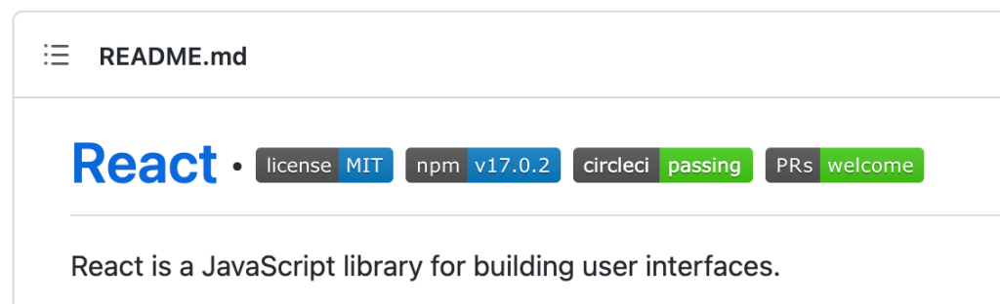
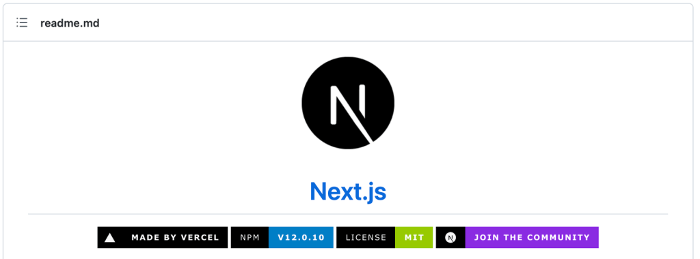
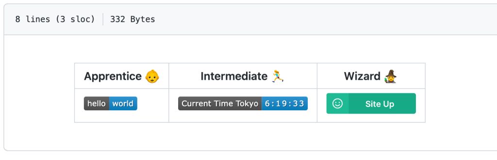
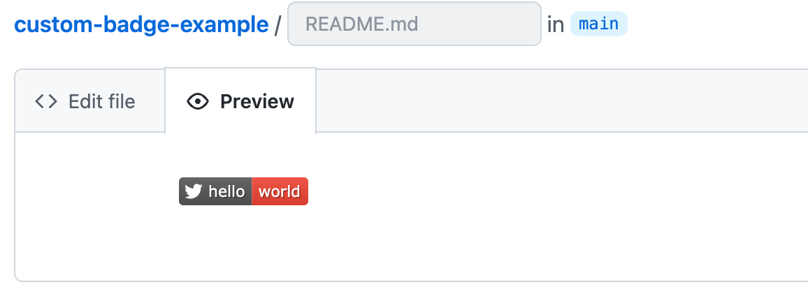
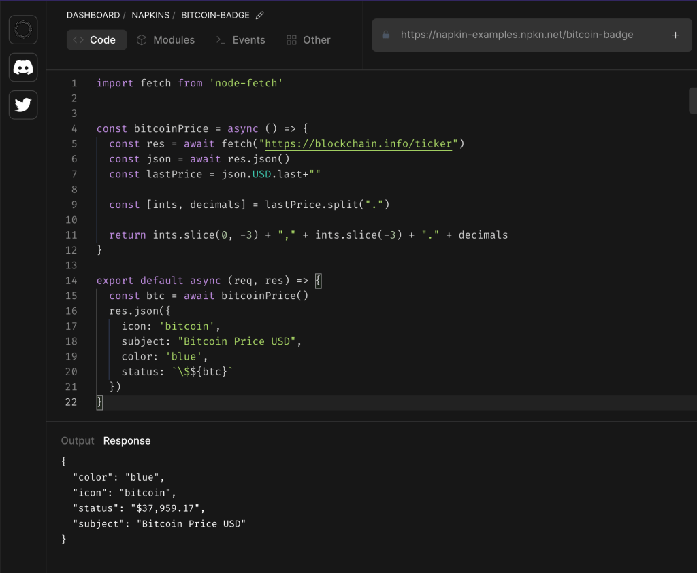
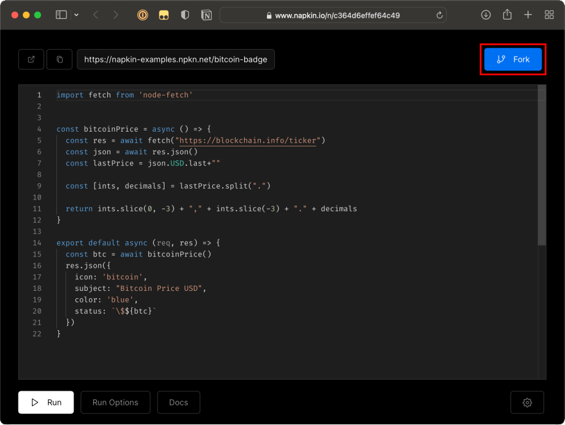
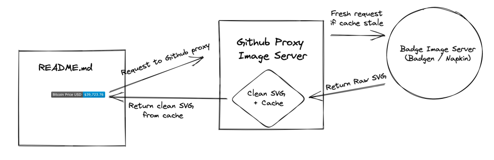
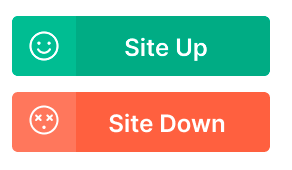
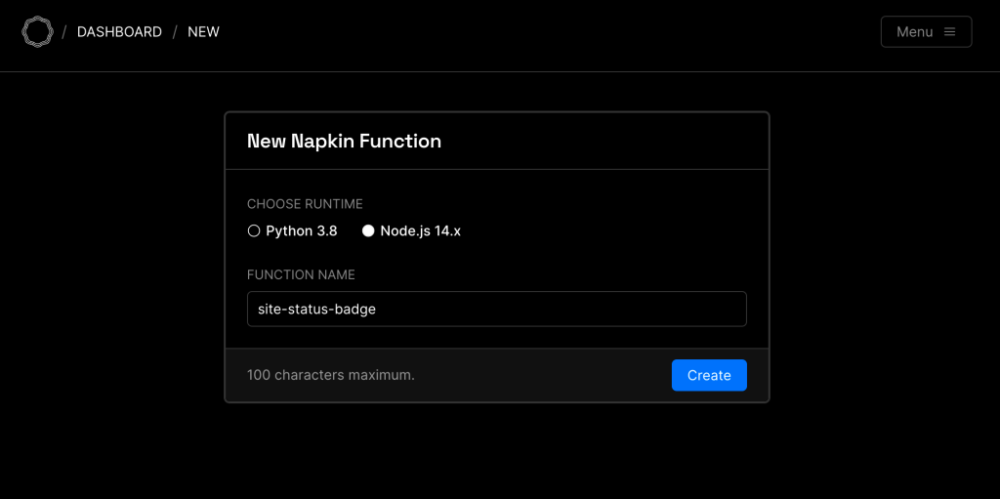
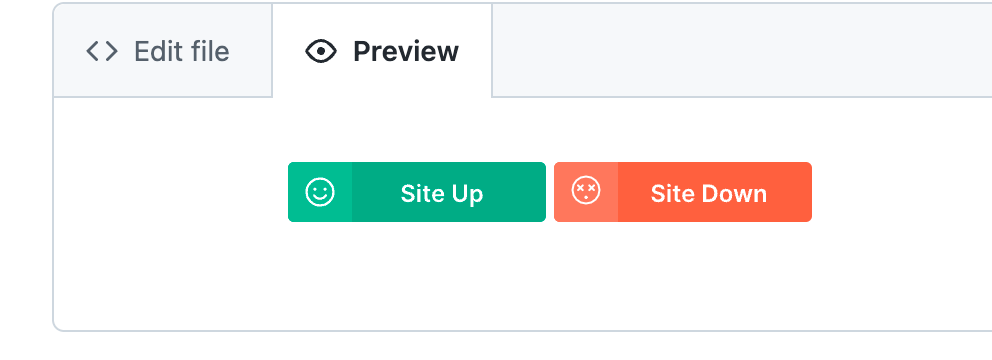

2022-05-03  
[Оригинальная статья](https://css-tricks.com/adding-custom-github-badges-to-your-repo/)

```table-of-contents
title: Содержание:
style: nestedList # TOC style (nestedList|inlineFirstLevel)
minLevel: 0 # Include headings from the specified level
maxLevel: 0 # Include headings up to the specified level
includeLinks: true # Make headings clickable
debugInConsole: false # Print debug info in Obsidian console
```

Если вы потратили время на просмотр репозиториев с открытым исходным кодом на GitHub, вы, вероятно, заметили, что большинство из них используют значки в своих файлах README. Возьмем, к примеру, официальный репозиторий React. По всему файлу README есть значки GitHub, которые сообщают важную динамическую информацию, например о последней выпущенной версии и о том, проходит ли текущая сборка.



Подобные значки предоставляют хороший способ выделить ключевую информацию о репозитории. Вы даже можете использовать свои собственные ресурсы в качестве значков, как это делает Next.js в своем репозитории.



Но самое полезное в значках GitHub — это то, что они обновляются _сами по себе_ . Вместо жесткого кодирования значений в вашем README значки в GitHub могут автоматически получать изменения с удаленного сервера.

Давайте обсудим, как добавить динамические значки GitHub в файл README вашего собственного проекта. Мы начнем с использования онлайн-генератора [badgen.net](http://badgen.net/) для создания базовых значков. Затем мы сделаем наши значки динамическими, подключив их к нашей собственной бессерверной функции через [Napkin](http://napkin.io/) . Наконец, мы сделаем еще один шаг вперед, используя наши собственные файлы SVG.



### Прежде всего: как работают значки?

Прежде чем мы начнем создавать значки в GitHub, давайте кратко рассмотрим, как они реализуются. На самом деле все очень просто: **значки — это просто изображения** . Файлы README написаны в Markdown, а Markdown поддерживает такие изображения:

```markdown

```

Тот факт, что мы можем включить URL-адрес изображения, означает, что страница Markdown будет запрашивать данные изображения с сервера при отображении страницы. Итак, **если мы контролируем сервер, на котором находится изображение, мы можем изменить, какое изображение будет отправлено обратно, используя любую логику, которую мы хотим!**

К счастью, у нас есть несколько вариантов развертывания нашей собственной серверной логики без всей части «настройки сервера». В базовых случаях использования мы можем создавать изображения значков GitHub с помощью [badgen.net,](http://badgen.net/) используя его предопределенные шаблоны. И снова, [Napkin](http://napkin.io/) позволит нам быстро написать бессерверную функцию в нашем браузере, а затем развернуть ее в качестве конечной точки, с которой смогут взаимодействовать наши значки GitHub.

### Изготовление значков с Badgen

Начнем с самого простого решения для значков: статического значка через [badgen.net](http://badgen.net/) . API Badgen использует шаблоны URL-адресов для оперативного создания шаблонных значков. Шаблон URL-адреса следующий:

```http
https://badgen.net/badge/:subject/:status/:color?icon=github
```

Полный список доступных вариантов цветов, значков и многого другого можно найти на [сайте badgen.net](http://badgen.net/) . В этом примере давайте воспользуемся этими значениями:

- `:subject`: Привет
- `:status:`: Мир
- `:color:`: красный
- `:icon:`: твиттер

Наш конечный URL-адрес выглядит следующим образом:

```http
https://badgen.net/badge/hello/world/red?icon=twitter
```


### Добавление значка GitHub в файл README

Теперь нам нужно встроить этот значок в файл README нашего репозитория GitHub. Мы можем сделать это в Markdown, используя синтаксис, который мы рассмотрели ранее:

```markdown

```



Badgen предлагает множество различных опций, поэтому я советую вам зайти на их сайт и поиграть! Например, один из шаблонов позволяет вам показать, сколько раз был помечен определенный репозиторий GitHub. Вот , например, [значок stars GitHub для репозитория Next.js :](https://badgen.net/github/stars/vercel/next.js)

```http
https://badgen.net/github/stars/vercel/next.js
```


Довольно круто! Но что, если вы хотите, чтобы на вашем значке отображалась информация, которую Badgen изначально не поддерживает? К счастью, у Badgen есть шаблон URL-адреса для использования ваших собственных конечных точек HTTPS для получения данных:

```http
https://badgen.net/https/url/to/your/endpoint
```

Например, предположим, что мы хотим, чтобы на нашем значке отображалась текущая цена биткойнов в долларах США. Все, что нам нужно, — это пользовательская конечная точка, которая возвращает эти данные в формате JSON, например:

```json
{
  "color": "blue",
  "status": "$39,333.7",
  "subject": "Bitcoin Price USD"
}
```

Предполагая, что наша конечная точка доступна по адресу `https://some-endpoint.example.com/bitcoin`, мы можем передать ее данные в Badgen, используя следующую схему URL-адресов:

```http
https://badgen.net/https/some-endpoint.example.com/bitcoin
```


Данные о стоимости биткойнов передаются прямо на значок GitHub.
### Badgen + Napkin

Существует множество способов получить собственную конечную точку HTTPS. Вы можете развернуть сервер с помощью DigitalOcean или AWS EC2 или использовать бессерверный вариант, например Google Cloud Functions или AWS Lambda; однако все это может оказаться немного сложным и утомительным для нашего простого варианта использования. Вот почему я предлагаю использовать [редактор функций Napkin в браузере](https://www.napkin.io/sandbox) для написания кода и развертывания конечной точки без какой-либо установки или настройки.

[Перейдите к примеру значка Bitcoin от Napkin,](https://napkin.io/examples/bitcoin-badge) чтобы увидеть пример конечной точки. Вы можете увидеть код для получения текущей цены биткойнов и возврата ее в формате JSON в редакторе. Вы можете запустить код самостоятельно из редактора или напрямую использовать конечную точку.



Чтобы использовать конечную точку с Badgen, работайте с той же схемой URL-адресов, описанной выше, только на этот раз с конечной точкой Napkin:

```
https://badgen.net/https/napkin-examples.npkn.net/bitcoin-badge
```


### Дополнительные способы настройки значков GitHub

Далее давайте [разветвим эту функцию](https://napkin.io/examples/bitcoin-badge) , чтобы добавить к ней собственный код. Для этого нажмите кнопку «Вилка» в правом верхнем углу. Вам будет предложено создать учетную запись в Napkin, если вы еще не вошли в систему.


После успешного разветвления функции мы можем добавить любой код, какой захотим, используя любые модули npm. Давайте добавим [пакет npm Moment.js](https://www.npmjs.com/package/moment/v/1.1.0) и обновим ответ конечной точки, чтобы показать время последнего обновления цены биткойнов прямо в нашем значке GitHub:

```js
import fetch from 'node-fetch'
import moment from 'moment'

const bitcoinPrice = async () => {
  const res = await fetch("<https://blockchain.info/ticker>")
  const json = await res.json()
  const lastPrice = json.USD.last+""

  const [ints, decimals] = lastPrice.split(".")

  return ints.slice(0, -3) + "," + ints.slice(-3) + "." + decimals
}

export default async (req, res) => {
  const btc = await bitcoinPrice()

  res.json({
    icon: 'bitcoin',
    subject: `Bitcoin Price USD (${moment().format('h:mma')})`,
    color: 'blue',
    status: `\\$${btc}`
  })
}
```


Разверните функцию, обновите URL-адрес, и вот что мы получим.  
Вы можете заметить, что обновление значка занимает некоторое время при следующей загрузке файла README на GitHub. Это связано с тем, что GitHub использует механизм прокси для предоставления изображений бейджей.



GitHub предоставляет изображения значков таким образом, чтобы предотвратить злоупотребления, такие как большой объем запросов или внедрение кода JavaScript. Мы не можем контролировать прокси-сервер GitHub, но, к счастью, он не кэширует слишком агрессивно (иначе это как бы противоречит цели значков). По моему опыту, TTL составляет около 5-10 минут.

### Пользовательские значки SVG с Napkin

Для нашего последнего трюка давайте воспользуемся Napkin, чтобы отправить обратно совершенно новый SVG, чтобы мы могли использовать собственные изображения, как мы видели в репозитории Next.js.  
Распространенным вариантом использования значков GitHub является отображение текущего статуса веб-сайта. Давайте сделаем это. Вот два штата, которые будет поддерживать наш значок:



Badgen не поддерживает пользовательские SVG, поэтому вместо этого наш значок будет напрямую обращаться к нашей конечной точке Napkin. Давайте создадим для этого новую функцию Napkin под названием `site-status-badge`.



Код этой функции выполняет запрос к `example.com`. Если статус запроса равен 200, он возвращает зеленый значок в виде файла SVG; в противном случае возвращается красный значок. Вы можете [проверить функцию](https://napkin.io/examples/site-status-badge) , ниже видите этот код:

```js
import fetch from 'node-fetch'

const site_url = "<https://example.com>"

// full SVGs at <https://napkin.io/examples/site-status-badge>
const customUpBadge = ''
const customDownBadge = ''

const isSiteUp = async () => {
  const res = await fetch(site_url)
  return res.ok
}

export default async (req, res) => {
  const forceFail = req.path?.endsWith('/400')

  const healthy = await isSiteUp()
  res.set('content-type', 'image/svg+xml')
  if (healthy && !forceFail) {
    res.send(Buffer.from(customUpBadge).toString('base64'))
  } else {
    res.send(Buffer.from(customDownBadge).toString('base64'))
  }
}
```

Вероятность того, что сайт `example.com` когда-либо выйдет из строя довольно мала, однако я добавил отображение, когда сайт недоступен. Добавляем `/400`после URL-адреса конечной точки Napkin чтобы увидеть такой случай:

```markdown


```

  



