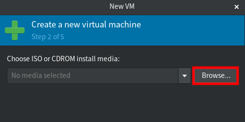
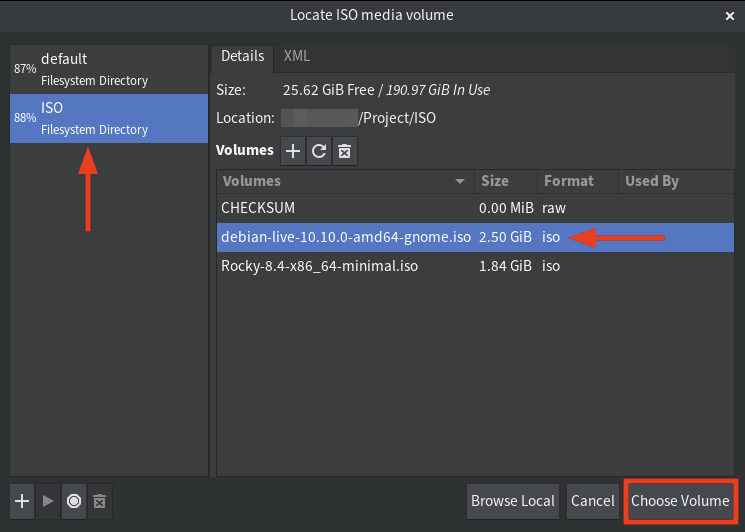

2020-11-17
```table-of-contents
title: Содержание:
style: nestedList # TOC style (nestedList|inlineFirstLevel)
minLevel: 0 # Include headings from the specified level
maxLevel: 0 # Include headings up to the specified level
includeLinks: true # Make headings clickable
debugInConsole: false # Print debug info in Obsidian console
```
## Что такое KVM?

KVM — это аббревиатура от Kernel-based Virtual Machine, это технологическое решение для виртуализации на основе модуля ядра Linux. KVM — это программное решение с открытым исходным кодом, работающее на машине Linux x86 с поддержкой расширений аппаратной виртуализации Intel VT или AMD-V. Модуль ядра KVM поставляется с ядром Linux, начиная с версии 2.6.20, и был портирован на другие операционные системы, такие как FreeBSD и Illumos, в виде загружаемых модулей ядра.

Технология KVM превратит Linux-машину в гипервизор виртуализации, который называется хост-машиной. На хост-компьютере вы сможете создать несколько изолированных систем, называемых виртуальными машинами (ВМ). Каждая виртуальная машина имеет свою систему (это может быть Linux, Windows или BSD), а также собственное виртуализированное оборудование, такое как память, процессоры, сетевая карта, диск, графика и т. д.
## Что такое QEMU?

QEMU или Quick Emulator — это эмулятор системы с открытым исходным кодом и виртуализатор для аппаратной виртуализации. Как правило, он используется в качестве виртуализатора с модулем ядра KVM для запуска виртуальных машин. Для достижения высокой производительности гостевых/виртуальных машин будут использоваться расширения аппаратной виртуализации, такие как Intel VT или AMD-V. Виртуализация QEMU/KVM в основном используется в качестве гипервизора в центре обработки данных.

В этом руководстве вы узнаете, как настроить виртуализацию KVM/QEMU на машине Archlinux/Manjaro. Кроме того, вы узнаете, как создать первую виртуальную машину с помощью графического приложения «virt-manager» — настольного пользовательского интерфейса для управления виртуальными машинами.
## Требования

- Archlinux/Manjaro с архитектурой x86 или 64-бит.
- ЦП/процессор с поддержкой виртуализации (Intel VT или AMD-V).
- Пользователь без полномочий root с привилегиями sudo root.
## Проверка архитектуры системы и поддержки виртуализации ЦП

Сначала проверьте архитектуру машины и аппаратную поддержку ускорения виртуализации Intel VT для процессоров Intel и AMD-v для процессоров AMD.

1. Выполните следующую команду, чтобы проверить системную архитектуру вашей системы.

```shell
uname -m
```

Вы получите следующий вывод.

`Linux machine1 5.4.134-1 #1 SMP PREEMPT Tue Jul 06 08:10:03 UTC 2021 x86_64 GNU/Linux`

Как видно, в настоящее время используется система Linux с «x86_64» или «64-битной» архитектурой и версией ядра «5.4».

2. Затем проверьте поддержку аппаратной виртуализации, выполнив следующую команду.

```shell
sudo lscpu | grep Virtualization
```

Для процессора Intel вы увидите аналогичный вывод, как показано ниже.

`Virtualization:                  VT-x`

А для процессоров AMD ниже приведен аналогичный вывод.

`Virtualization:                  AMD-V`

3. При желании вы можете включить вложенную виртуализацию на своем компьютере с помощью следующей команды.

```shell
sudo modprobe -r kvm_intel  
sudo modprobe kvm_intel nested=1
```

После этого выполните следующую команду, чтобы проверить вложенную виртуализацию.

```shell
cat /sys/module/kvm_intel/parameters/nested
```

Если вы получите вывод, например, \Y\ или \1\, это означает, что функция вложенной виртуализации включена. В противном случае вы увидите сообщение об ошибке «Нет такого файла или каталога».
## Установка пакетов QEMU и Virt-Manager

1. Чтобы установить пакеты qemu и virt-manager, выполните приведенную ниже команду.

```shell
sudo pacman -S qemu virt-manager libvirt virt-viewer dnsmasq vde2 bridge-utils openbsd-netcat ebtables libguestfs
```

Для системы manjaro будет конфликт пакетов между iptables и ebtables. Введите \y\, чтобы удалить пакет iptables по умолчанию и заменить его на \ebtables\ и \nftables\.

Ниже приведены основные пакеты, которые вы должны знать:

- qemu: эмулятор машин и виртуализатор с открытым исходным кодом.
- виртуальный менеджер; Приложение с графическим интерфейсом для управления виртуальными машинами.
- libvirt: API для управления механизмами виртуализации, такими как KVM, QEMU и т. д.
- dnsmasq: облегченный сервер пересылки DNS и DHCP-сервер.
- bridge-utils: Утилиты для настройки сетевого моста Linux.
- libguestfs: набор инструментов для изменения образов дисков виртуальных машин (ВМ).

2. Затем запустите и включите службу libvirtd с помощью следующей команды.

```shell
sudo systemctl enable --now libvirtd
```

Вы получите аналогичный результат, как показано ниже.

```
Created symlink /etc/systemd/system/multi-user.target.wants/libvirtd.service → /usr/lib/systemd/system/libvirtd.service.  
Created symlink /etc/systemd/system/sockets.target.wants/virtlockd.socket → /usr/lib/systemd/system/virtlockd.socket.  
Created symlink /etc/systemd/system/sockets.target.wants/virtlogd.socket → /usr/lib/systemd/system/virtlogd.socket.  
Created symlink /etc/systemd/system/sockets.target.wants/libvirtd.socket → /usr/lib/systemd/system/libvirtd.socket.  
Created symlink /etc/systemd/system/sockets.target.wants/libvirtd-ro.socket → /usr/lib/systemd/system/libvirtd-ro.socket.
```

3. После этого выполните следующую команду, чтобы проверить состояние службы libvirtd.

```shell
sudo systemctl status libvirtd
```

И вы должны увидеть аналогичный вывод, как показано ниже. Как видно, служба libvritd активна и работает.

```
? libvirtd.service - Virtualization daemon  
     Loaded: loaded (/usr/lib/systemd/system/libvirtd.service; disabled; vendor preset: disabled)  
     Active: active (running) since Fri 2021-07-23 10:33:25 UTC; 6s ago  
TriggeredBy: ? libvirtd-ro.socket  
             ? libvirtd.socket  
             ? libvirtd-admin.socket  
       Docs: man:libvirtd(8)  
             https://libvirt.org  
   Main PID: 16828 (libvirtd)  
      Tasks: 19 (limit: 32768)  
     Memory: 16.4M  
        CPU: 226ms  
     CGroup: /system.slice/libvirtd.service  
             ??16828 /usr/bin/libvirtd --timeout 120
```
## Разрешение пользователю без полномочий root использовать виртуализацию KVM/QEMU

По умолчанию только пользователь root может создавать виртуальные машины и управлять ими. Чтобы разрешить пользователям без полномочий root создавать виртуальные машины и управлять ими, вы должны следовать приведенной ниже конфигурации libvirtd.

1. Выполните следующую команду, чтобы изменить конфигурацию libvirtd.

```shell
sudo nano /etc/libvirt/libvirtd.conf
```

Раскомментируйте опцию \unix_sock_group\ и введите имя группы как \libvirt\.

```q
# Set the UNIX domain socket group ownership. This can be used to  
# allow a 'trusted' set of users access to management capabilities  
# without becoming root.  
#  
# This setting is not required or honoured if using systemd socket  
# activation.  
#  
# This is restricted to 'root' by default.  
unix_sock_group = "libvirt"
```

После этого раскомментируйте параметр «unix_sock_rw_perms» и оставьте разрешение по умолчанию «0770».

```q
# Set the UNIX socket permissions for the R/W socket. This is used  
# for full management of VMs  
#  
# This setting is not required or honoured if using systemd socket  
# activation.  
#  
# Default allows only root. If PolicyKit is enabled on the socket,  
# the default will change to allow everyone (eg, 0777)  
#  
# If not using PolicyKit and setting group ownership for access  
# control, then you may want to relax this too.  
unix_sock_rw_perms = "0770"
```

Сохраните конфигурацию, нажав кнопку Ctrl+x и введите y, затем введите.

2. Затем добавьте своего пользователя в группу \libvirt\, используя следующую команду.

```shell
sudo usermod -a -G libvirt $USER
```

3. После этого перезапустите службу libvirtd, чтобы применить новую конфигурацию.

```shell
sudo systemctl restart libvirtd
```

Теперь все пользователи группы `libvirt` смогут создавать и настраивать виртуальные машины.
## Проверка установки QEMU/KVM с помощью virt-manager

Теперь откройте приложение «virt-manager» из меню вашего приложения.

1. Щелкните меню Правка -> Свойства подключения в приложении virt-manager.


2. На вкладке «Обзор» вы увидите, что virt-manager автоматически подключится к «qemu:///system».


3. Перейдите на вкладки «Виртуальные сети», и вы увидите конфигурацию сети «по умолчанию».

- Интерфейс: virbr0
- Автозапуск при загрузке: да
- IP-адрес: 192.168.122.0/24.
- Диапазон IP-адресов DHCP: 192.168.122.2 - 192.168.122.254
- Тип сети: NAT


4. Теперь перейдите на вкладку «Пространство данных», и вы увидите конфигурацию хранилища пула «default».

- Тип: Каталог в файловой системе.
- Размер: зависит от вашего диска.
- Расположение: /var/lib/libvirt/images
- Автозапуск при загрузке: да

Все образы виртуальных машин будут доступны в этом хранилище по умолчанию, в каталоге \/var/lib/libvirt/images\.


5. Затем нажмите кнопку \+\, чтобы создать новое хранилище пула для файлов образов ISO. Все файлы ISO операционных систем будут доступны в этом пуле.

Следуйте конфигурации хранилища, как показано ниже:

- Название: ISO
- Тип: dir: Каталог в файловой системе
- Целевой путь: /path/directory/to/your/iso/


Нажмите кнопку «Готово», чтобы завершить процесс. После этого вы готовы создавать новые виртуальные машины.

## Создание новой виртуальной машины с помощью virt-manager

1. В приложении virt-manager нажмите кнопку «+», чтобы создать новую виртуальную машину.


2. Выберите «Локальный ISO или CD-ROM», чтобы использовать образ ISO для установки, и нажмите кнопку «Вперед», чтобы продолжить.


3. Нажмите кнопку «Обзор», чтобы выбрать файл ISO.



Теперь выберите хранилище пула \ISO\ и выберите файл iso для установки (в данном примере это \Debian 10\), затем нажмите \Выбрать том\.



Снимите флажок «Автоматически определять по носителю», введите операционную систему, которую вы хотите установить (в данном примере это «Debian 10»), затем снова нажмите кнопку «Вперед», чтобы продолжить.


4. Выберите объем памяти и ЦП для виртуальной машины, затем нажмите «Вперед».


5. Выберите объем диска для виртуальной машины и нажмите «Вперед».


6. Дважды проверьте конфигурацию и нажмите кнопку «Готово» для установки.


7. Теперь виртуальная машина запущена и работает с виртуализацией QEMU/KVM, и вы можете продолжить установку ОС.


## Заключение

