2024-08-22  
[Источник](https://te-st.org/2024/07/22/element-instruction-install-and-use/)

```table-of-contents
title: Содержание
style: nestedList # TOC style (nestedList|nestedOrderedList|inlineFirstLevel)
minLevel: 0 # Include headings from the specified level
maxLevel: 0 # Include headings up to the specified level
includeLinks: true # Make headings clickable
hideWhenEmpty: false # Hide TOC if no headings are found
debugInConsole: false # Print debug info in Obsidian console
```
## Почему Element?

Element — бесплатный децентрализованный мессенджер со сквозным шифрованием, который обеспечивает анонимность пользователей. В отличие от большинства современных мессенджеров вроде Telegram, WhatsApp или Signal, Element не требует номер мобильного телефона при регистрации. Поэтому он может заинтересовать в первую очередь тех, кто предпочитает не делиться никакими данными о себе. 

Как все его конкуренты, Element имеет достоинства и недостатки. Например, этот  мессенджер лишен функции автоматического удаления сообщений по таймеру. Если перед вами стоит задача выбора мессенджера, следует учитывать критерии, которые больше всего соответствуют вашей модели угроз. Мы предлагаем краткую инструкцию, задача которой — немного расчистить пользователю дорогу к освоению этого специфического и не самого интуитивного мессенджера. Более подробные инструкции по настройке Element читателю придется поискать самому. Также обратите внимание на наш [видеокурс по Element](https://youtu.be/eS54NhMrxzs?si=jYH2876IgORtf1Gd).

## Глава 1. Установка Element

### 1. Создание анонимного аккаунта email

Для начала создадим новый почтовый аккаунт, например, в [Proton Mail](https://proton.me/mail). Мы не советуем использовать вашу рабочую или личную почту для привязки будущего аккаунта Element: это может навредить вашей анонимности. При создании аккаунта Proton Mail не добавляйте другой адрес email или номер телефона.

Придумывая анонимный адрес email, не используйте данные, по которым его можно будет связать с вашей реальной личностью. Дмитрию Иванову, живущему в Париже, не подойдут такие адреса, как [[email protected]](https://te-st.org/cdn-cgi/l/email-protection), [[email protected]](https://te-st.org/cdn-cgi/l/email-protection), [[email protected]](https://te-st.org/cdn-cgi/l/email-protection). Даже [[email protected]](https://te-st.org/cdn-cgi/l/email-protection) не подойдет, если Дима в свободное время играет на бас-гитаре в рок-группе. Люди часто стараются подчеркнуть свою индивидуальность в никнеймах, что работает против идеи анонимности. Хороший для наших целей ник может выглядеть как [[email protected]](https://te-st.org/cdn-cgi/l/email-protection), [[email protected]](https://te-st.org/cdn-cgi/l/email-protection), [[email protected]](https://te-st.org/cdn-cgi/l/email-protection) и т.п.

Не используйте уже существующий ник. Если в Telegram вы CheddarCheese, а ваш рабочий адрес [[email protected]](https://te-st.org/cdn-cgi/l/email-protection), для нового анонимного аккаунта понадобится что-то другое.

Пароль к аккаунту email лучше хранить в менеджере паролей, таком как [Bitwarden](https://safe.roskomsvoboda.org/bitwarden) или [KeePassXC](https://safe.roskomsvoboda.org/keepassx). После создания аккаунта не забудьте [включить в настройках двухфакторную аутентификацию.](https://proton.me/support/two-factor-authentication-2fa) Лучше использовать мобильное приложение генератора кодов. Обязательно [создайте резервные коды](https://te-st.org/2021/11/16/backup-codes/) и сохраните их в надежном месте (например, в зашифрованном файле или менеджере паролей).

### 2. Создание аккаунта Element

Регистрируемся в Element через новоиспеченную анонимную почту. Мы не советуем логиниться в Element через аккаунты Google, Github, Facebook и т.д. — это увеличивает связность ресурсов. Чем выше связность, тем выше шансы злоумышленника через доступ к одному ресурсу получить доступ к другим ресурсам. 

- Откройте в браузере [страницу регистрации на официальном сайте Element](https://app.element.io/#/register).
- Анонимная сеть Matrix служит основой для работы мессенджера Element. Вы увидите слова «Ваша учетная запись обслуживается» и адрес matrix.org по умолчанию. Если у вас нет своего или иного доверенного сервера Matrix на примете, выбирайте сервер по умолчанию. 

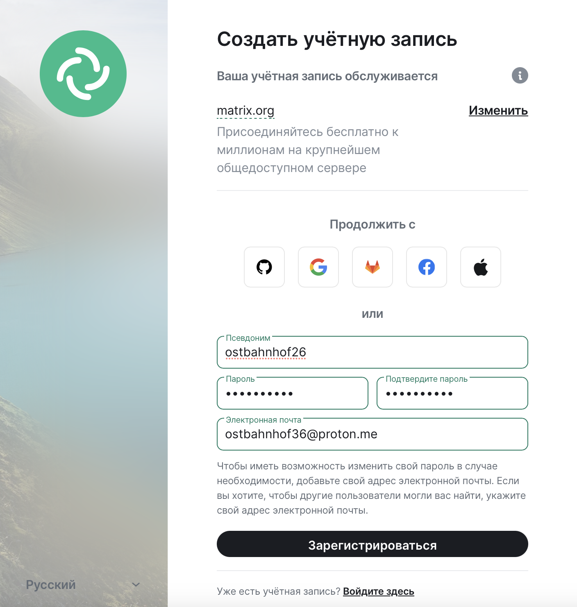

- Придумайте никнейм (псевдоним). Руководствуйтесь советами для анонимной почты выше. 
- После заполнения остальных полей и политики использования Matrix нажмите кнопку «Зарегистрироваться».
- На указанный email придет письмо от Matrix Notifications с названием «Validate your email». Подтвердите регистрацию по ссылке в письме («Verify Your Email Address»).
    
    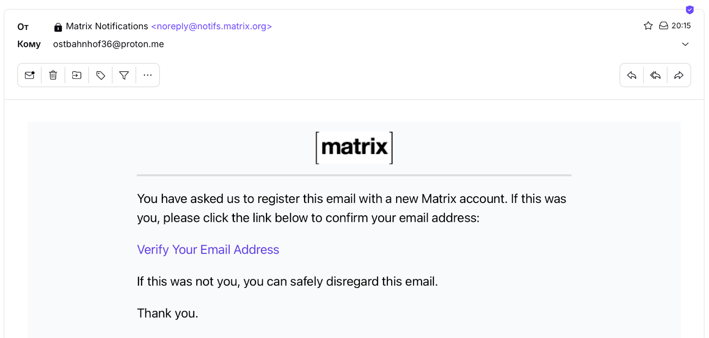
    

- В отдельном окне браузера Matrix сообщит, что аккаунт создан и окно можно закрыть.
- Вопрос «С кем вы будете общаться чаще всего?» можно пропустить.

Ваш аккаунт Element создан! Вы находитесь в главном окне Element. Слева видны разделы «Люди» и «Комнаты», пока там пусто.

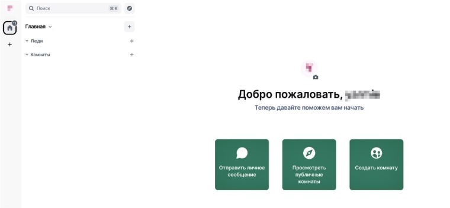

### 3. Необходимые настройки безопасности

Функция «безопасного резервного копирования» является очень важным шагом по обеспечению безопасности. Она гарантирует, что вы не потеряете доступ к вашим зашифрованным сообщениям и данным после выхода из аккаунта (но прочитать их сможете, только если будете залогинены на втором устройстве). 

- Зайдите в раздел настроек резервного копирования. Вы увидите такое окно:

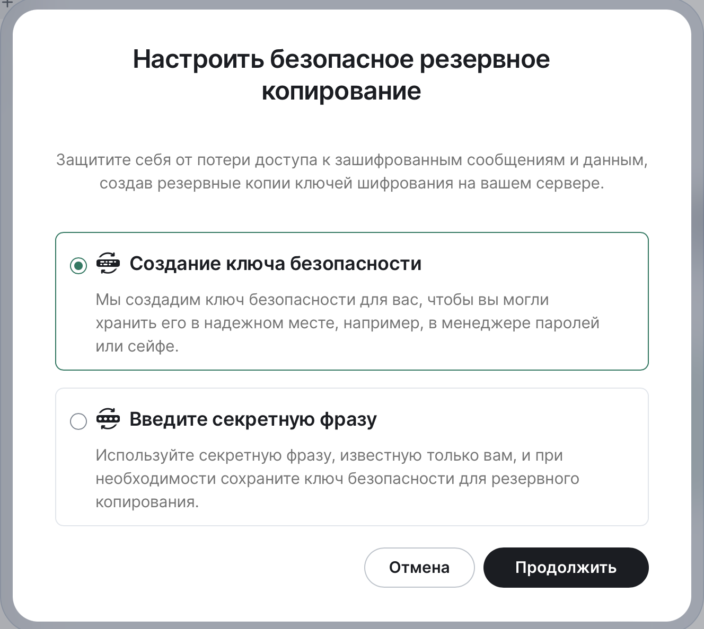

Если окна нет, зайдите в настройки. В панели слева нажмите на круг с первой буквой логина и перейдите в раздел «‎Безопасность». Вам нужен первый раздел — шифрование, и в нем «‎Настроить»‎.

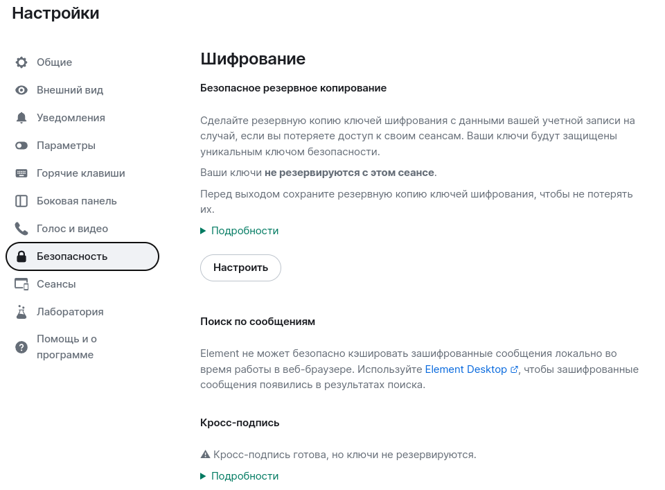

- Выберите один из способов резервного копирования: ключ (это случайный набор символов, который генерирует Element) или секретную фразу (ее вы можете задать сами, чтобы было проще запомнить).
- Сохраните его в надежном месте, можно в том же менеджере паролей. 
- После сохранения фразы вам предложат сохранить ключи безопасности. Ключи — резервный способ доступа к аккаунту на случай потери фразы. Рекомендуем не копировать их, а ‎скачать‎. Скачанный файл переназовите, чтобы не потерять, но не храните его в текстовом формате на рабочем столе.

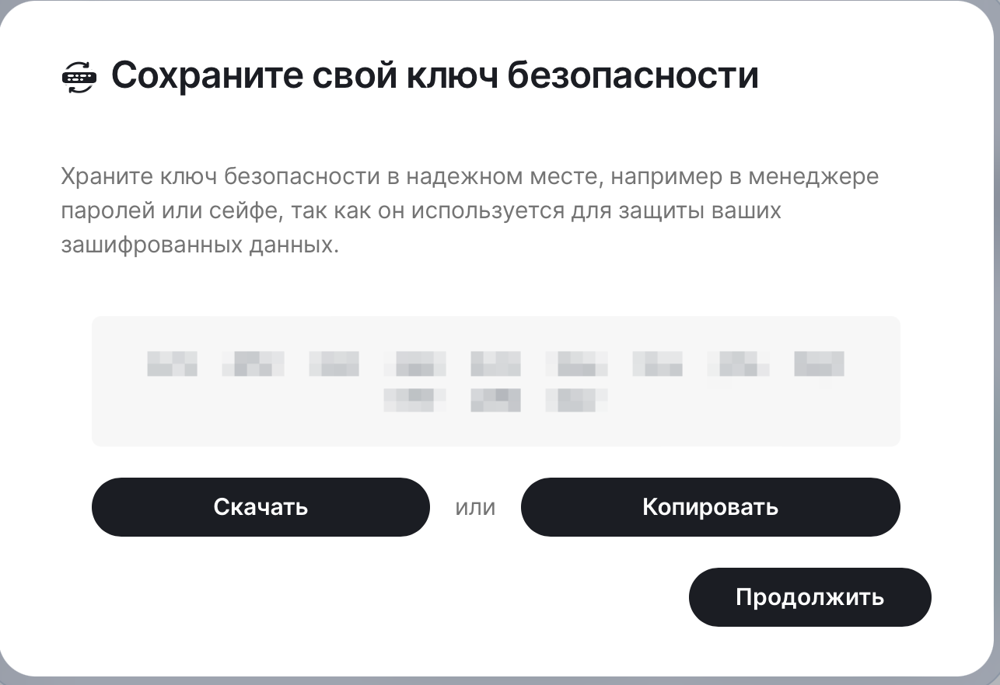

**Фраза или ключ безопасности потребуются (наряду с логином и паролем) при повторном входе в аккаунт (если нет активной сессии на другом устройстве, например, компьютере). Без них все переписки будут отображаться как зашифрованные.** 

Адрес электронной почты не обязателен для использования Element. После регистрации вы можете удалить его из своего профиля. 

### 4. Как не терять сообщения при выходе из аккаунта

У Element есть особенность: если сообщение в групповом или личном чате было отправлено, когда вы выходили из аккаунта, содержимое чата останется зашифрованным. Чтобы это не произошло, залогиньтесь в Element на втором устройстве*. 

_*При определенной модели угроз быть постоянно авторизованным небезопасно._

## Глава 2. Общение в чатах

### 5. Как присоединиться к чатам

Чаты в Element называются комнатами. Они бывают публичными и частными. К частной комнате можно присоединиться только по приглашению. Чтобы пригласить собеседника или собеседницу в свою комнату, нужно щелкнуть по его или ее имени правой кнопкой мыши и в выпадающем меню выбрать «Пригласить». Публичные комнаты открыты без приглашений. Если хотите подключиться к каким-нибудь публичным комнатам (или просто узнать, какими они бывают), нажмите кнопку в левом столбце рядом с окошком поиска. 

Комнаты можно организовывать в более крупные разделы, так называемые пространства. Они тоже бывают публичные и приватные (по приглашению). Можно комбинировать типы пространств и комнат ради создания комфортной рабочей среды. 

### 6. Версии Element: браузерная, десктопная, приложение 

Мессенджер можно использовать в браузере без установки, в десктопной версии и/или в мобильном приложении. Если вы постоянно находитесь или бываете в небезопасных странах и есть угроза несанкционированного доступа к устройству, попробуйте использовать только браузерную версию и не устанавливать программу или приложение.

Выберите нужные вам версии Element тут: [https://element.io/download](https://element.io/download)

### 7. Общение в личных сообщениях

- Узнайте у собеседников их имена в Element или сообщите им свое по другому безопасному каналу связи. 
- Если хотите сами начать беседу, найдите собеседника в Element. В разделе «‎Люди» нажмите «‎Отправить личное сообщение»:

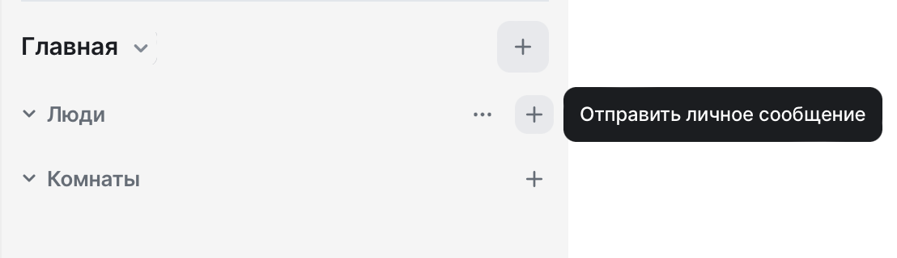

- Введите данные собеседника. Выберите из выпадающего списка нужного человека.

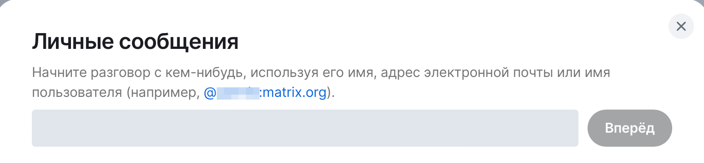

- Пригласите человека и начните общение.

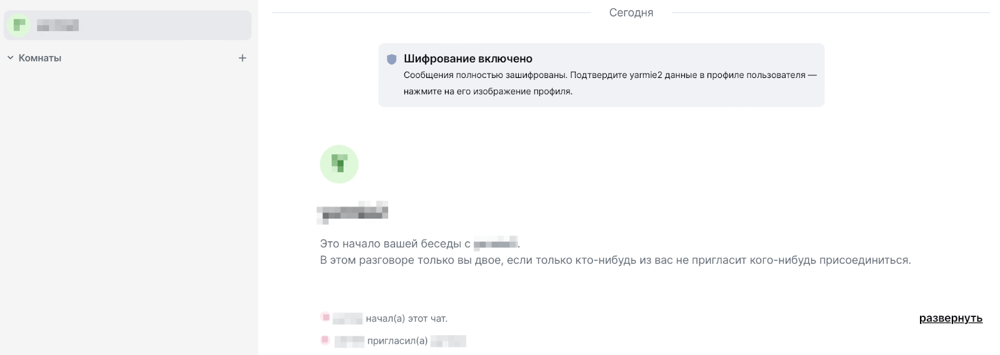

- Чтобы автоматически расшифровывать, что пишет человек, когда вы не в системе, верифицируйте собеседника. Для этого нажмите на иконку собеседника.

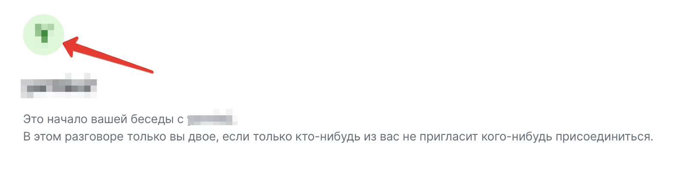

- Откроется окно с деталями переписки. Нажмите «‎Заверить»‎, сравните одноразовый код или эмодзи с собеседником.

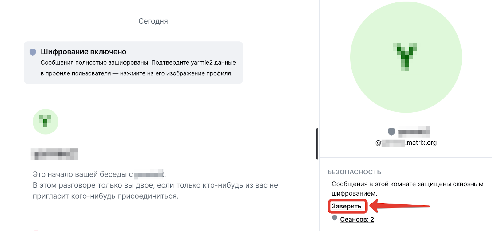

Если не верифицировать собеседника и выйти из аккаунта, все отправленные вам сообщения будут зашифрованы, и вы их не прочитаете. Чтобы этого не произошло, см. пункт выше «‎Важные настройки, чтобы не терять сообщения при выходе из аккаунта»‎.

### 8. Как не пропускать сообщения

Element — непривычный мессенджер. Поэтому в первое время вы можете забывать проверять его. Если вы живете в безопасных странах и не ездите в небезопасные, можно предпринять следующее:

1. Настроить пуш-уведомления.

Если вы пользуетесь десктопной версией или приложением:  
На компьютере: «‎Меню» (ваш аватар) → «‎Уведомления».  
На телефоне: «‎Меню» (ваш аватар) → User Settings → «‎Уведомления».

2. Настроить уведомления. Включите отправку уведомлений в десктопной версии.

Нажмите на аватарку → «‎Настройки» → «‎Уведомления». Выберите настройки, которые соответствуют вашей модели угроз.

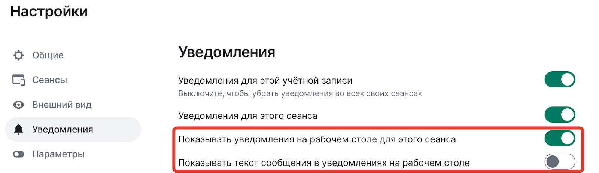

Мы рекомендуем выключить функцию «‎Показать расшифрованное содержимое»‎.

### 9. Смена отображаемого имени 

Пригодится, чтобы собеседники лучше понимали, с кем говорят. Ник будет скрыт, собеседники увидят только имя. Обратите внимание, что использование известного многим другим людям имени и тем более вашего реального имени может снизить вашу анонимность или даже однозначно идентифицировать вас. 

Выберите «Настройки» → «Общие» → «Отображаемое имя». Например: 

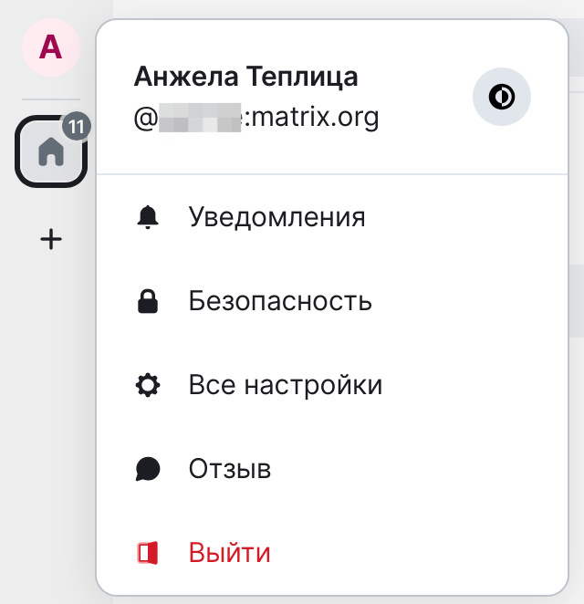

Также это поле можно использовать для обозначения временного статуса, например, «‎не на связи». Не добавляйте сюда информацию о своем местонахождении или привычках.

### 10. Использование Element при повышенном уровне угроз 

Следующие рекомендации подойдут тем, кто живет или бывает в небезопасных странах или регионах — там, где ваше устройство могут взломать или забрать при обыске. 

- Проверьте, все ли базовые меры защиты для ваших устройств и аккаунтов соблюдены (Полный список в разделе «‎Чеклист по базовой безопасности»‎).
- При пересечении границы советуем брать с собой запасные устройства, на которых вы не храните особенно важные данные и соответствующие приложения. Либо удалять Element с ваших устройств.
- При работе с Element рекомендуем использовать браузерную версию, лучше всего — в режиме инкогнито. 
- Если вы все-таки используете приложение на телефоне, отключите уведомления на телефоне. «‎Меню» (ваш аватар) → «‎Настройки» → «‎Уведомления».
- Если работаете с мобильным приложением Element, установите PIN-код в качестве дополнительной защиты (меню Безопасность — Настроить защиту).
- Не «вытаскивайте» сообщения из Element в менее безопасные условия. Если вам необходимо сохранить на компьютере файл из пространства/комнаты Element (скажем, фотографию для редактирования), не забудьте после завершения работы [удалить файлы с компьютера надежным способом](https://te-st.org/2020/08/04/erasedata/).
- Будьте осторожнее в беседах в Element, если приняли решение сохранять анонимность. Иногда идентифицировать человека можно по косвенным признакам, например, по манере общения и даже по его собственным рассказам.
- Если у вас есть доверенное лицо с доступом к вашим аккаунтам, которое в случае ЧП сможет сменить пароли, предоставьте ему доступ и к аккаунту Element.

## Глава 3. Чеклисты и FAQ

### 11. Чеклист по базовой цифровой безопасности

Element сможет защитить вашу переписку при условии, что вы заботитесь о безопасности ваших устройств в целом. 

Вот как может выглядеть минимальный чеклист:

- Пароль для входа в систему на компьютере.
- Защита входа на телефоне. (При повышенном уровне угроз лучше использовать пароль, Face-ID или отпечаток не рекомендуются).
- Надежные пароли и двухфакторная аутентификация в основных и часто используемых аккаунтах (включая Element).
- Пароли хранятся в надежном, защищенном месте.
- Вы не используете один и тот же пароль для нескольких аккаунтов.
- Вы не сохраняете конфиденциальные сообщения в файлах на своих устройствах или регулярно удаляете их.

### 12. Чеклист по подключению к Element

Давайте проверим, все ли вы настроили: 

- Аккаунт подключен к вашей неосновной почте, пароль от нее вы сохранили в менеджере паролей.
- Вы сохранили ваш псевдоним в Element и пароль от аккаунта.
- Вы включили безопасное резервное копирование.
- Вы сохранили фразу и/или ключи безопасности. 
- Вы сохранили ключ безопасности в текстовом виде и назвали его так, что сможете легко найти.
- Вы создали вторую сессию (Ghost session или логин на втором устройстве).
- Вы настроили уведомления в соответствии с вашей моделью угроз.

### 13. Для администраторов

1. Ответы на вопросы по использованию Element можно найти как в официальном [руководстве](https://static.element.io/pdfs/element-user-guide.pdf) по интерфейсу, так и в документации к протоколу — Matrix. 
2. Рекомендуем следить за разделом [Labs](https://element.io/labs) (Лаборатории), которая находится внутри личного кабинета в мессенджере.Там вы сможете отслеживать и тестировать новые функции мессенджера.

### 14. Поддержка по использованию Element и на другие темы

Если вам нужна помощь по установке и настройке мессенджера, пожалуйста, обратитесь в [Теплицу социальных технологий](https://te-st.org/other/?type=%D0%94%D1%80%D1%83%D0%B3%D0%BE%D0%B5). Коллеги готовы ответить на вопросы письменно или в видеочате.

Поддержка по цифровой безопасности и другим темам: [Индивидуальные консультации — Теплица социальных технологий](https://te-st.org/help/) 

### 15. FAQ (частые ошибки в использовании Element)

1. Я забыл_а/потерял_а пароль от аккаунта. Что делать?

Если вы забыли свой пароль, зайдите на сайт [app.element.io](https://app.element.io) и нажмите на «Войти», потом «‎Забыли пароль?» и следуйте указаниям. 

2. Я забыл(а)/потерял(а) ключ и секретную фразу. Что делать?

Если вы забыли ключ/фразу, можно зайти по скачанному ключу (в текстовом формате).

Как это сделать: 

- Нажмите на «‎Проверка с помощью ключа безопасности или фразы» 

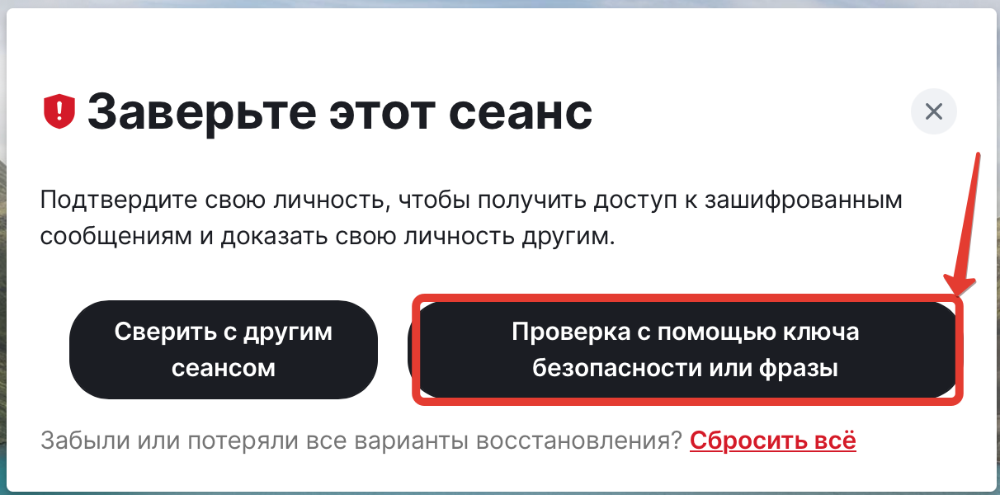

Если у вас не была задана мнемоническая фраза, картинка выше будет отличаться: вам сразу предложат ввести ключ.

- Вместо фразы или ключа нажмите на «‎используйте секретный ключ» ‎

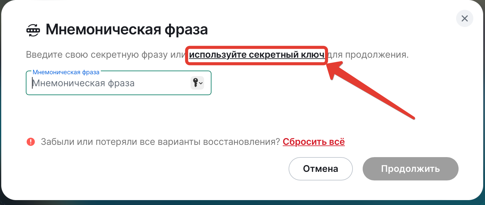

- В новом окне вам предложат ввести «бумажный» ключ. Скопируйте сохраненный ключ копипастом или загрузите файл с ключом в формате txt, который сохранили при регистрации аккаунта (кнопка «Загрузить»).

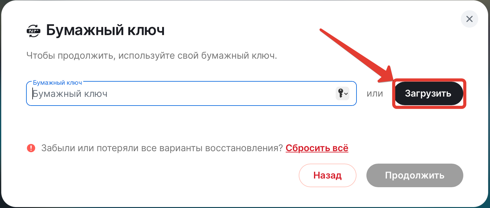

Если скачанные ключи потеряны, придется сбросить ключ и создать новый по той же схеме, что и при первоначальных настройках безопасности. 

При настройке новых ключей подтверждения вы увидите следующие экраны:  
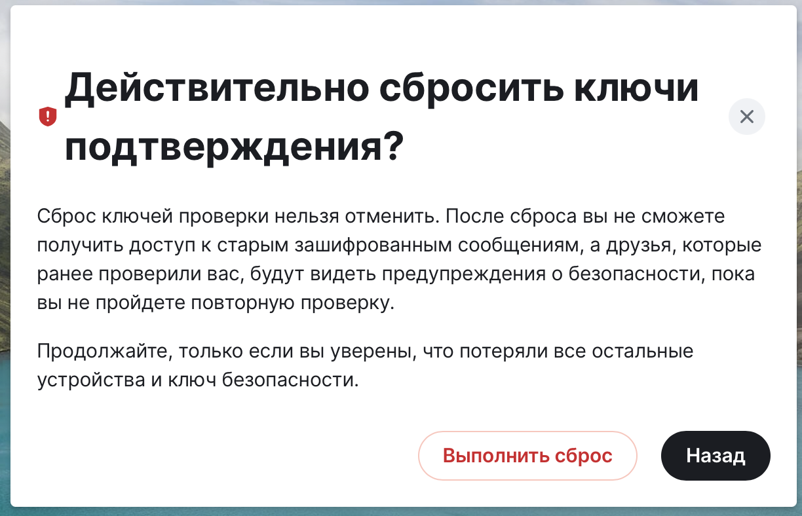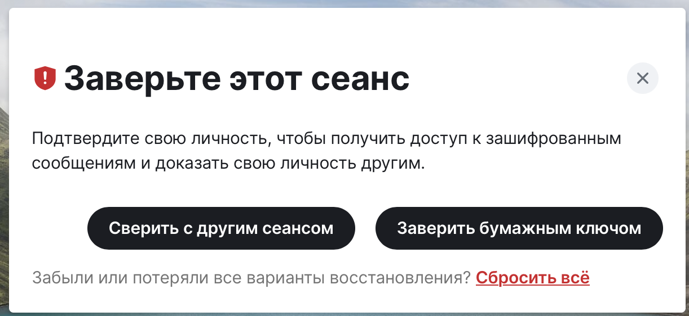


Обязательно сохраните новые ключи и/или секретную фразу. 

3. Я разлогинил(ась), и теперь мои переписки выглядят зашифрованными. Как это исправить? 

Нужно заново ввести логин и пароль. После ввода пароля у вас появится выбор: 

а) подтвердить вход с другого устройства, где вы залогинены или б) подтвердить вход секретной фразой или ключом. 

В первом случае вы увидите такой запрос: 

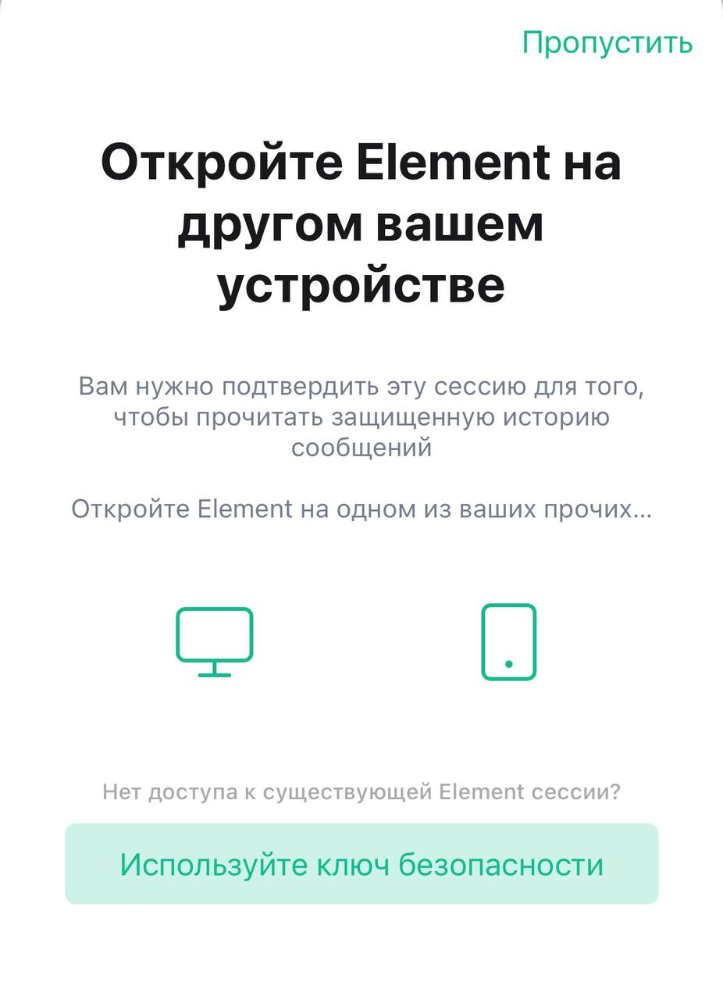

А на устройстве с активной сессией — такое окно:

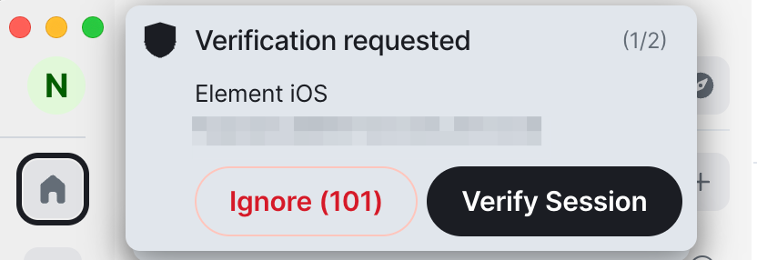

Нажмите «‎Verify Session» («‎Подтвердить сессию») и введите секретную фразу или ключ подтверждения. Все сообщения, пришедшие в то время, когда вы были разлогинены, останутся зашифрованными. 

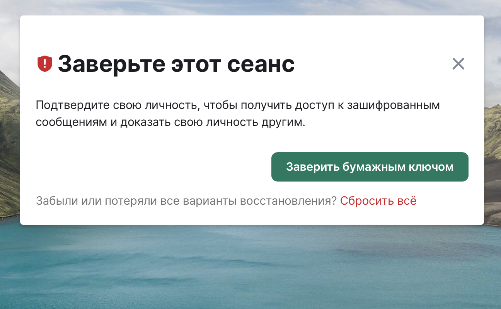

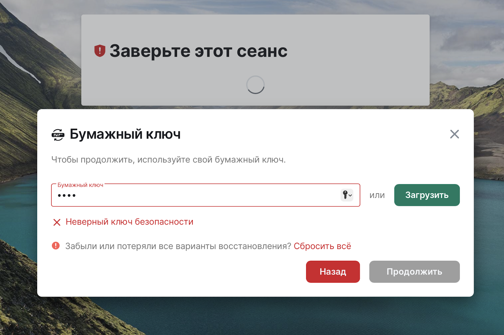

Вот как будут выглядеть зашифрованные переписки:

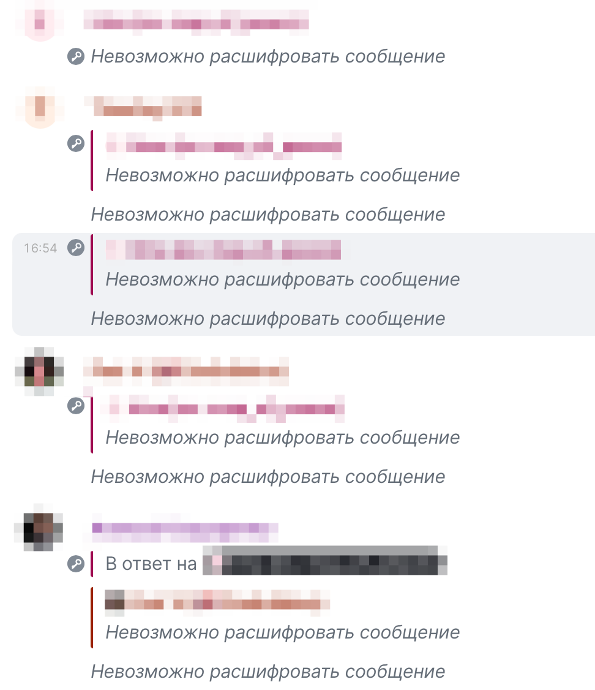

4. Счетчик сообщений работает некорректно. Как это поправить?

Это давняя [проблема](https://github.com/element-hq/element-web/issues/21114) Element. Попробуйте нажать на три точки рядом с названием комнаты (чата), в открывшемся окне выберите опцию «‎отметить как прочитанное/mark as read»‎. 

5. У меня зашифровались переписки.

Если вы только зашли в чат и видите, что все предыдущие сообщения зашифрованы, вероятно, это скрытая история сообщений. В таком случае, вам будут видны только последующие сообщения. Если вы не видите сообщения конкретного человека, необходимо заверить сеанс аккаунта. 

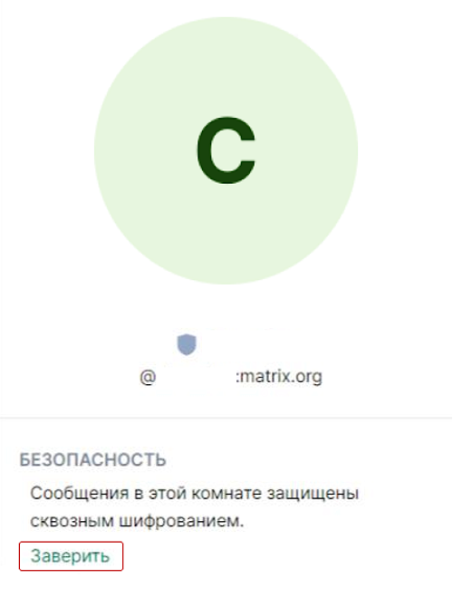

Важно это делать в тот момент, когда и вы, и владелец аккаунта находитесь в сети.

Если ваши сообщения не видны другим людям, значит, на вашем устройстве нет подходящего ключа. Чтобы это исправить:

- Проверьте, что у вас подключено резервное шифрование ключей. Перейдите в «Настройки пользователя» → «Безопасность и конфиденциальность» и нажмите «Начать использовать резервное копирование ключей».
- Проверьте, не вошли ли вы одновременно с нескольких устройств. Из-за этого может сбиваться синхронизация.
- В настройках безопасности проверьте подтверждение сеансов (не должно быть сеансов, подсвеченных красным цветом). Если есть неподтвержденные сеансы, подтвердите их.
- Попросите другого человека заверить ваш аккаунт (как в пункте 2)

6. Как поменять почту, к которой привязан аккаунт? 

Нажмите на значок с первой буквой ника → Зайдите в «‎Настройки» — «‎Общие»‎ →  Удалите старый email → Введите новый email. 

Обратите внимание, что на каждый email в Element можно зарегистрировать только один аккаунт.