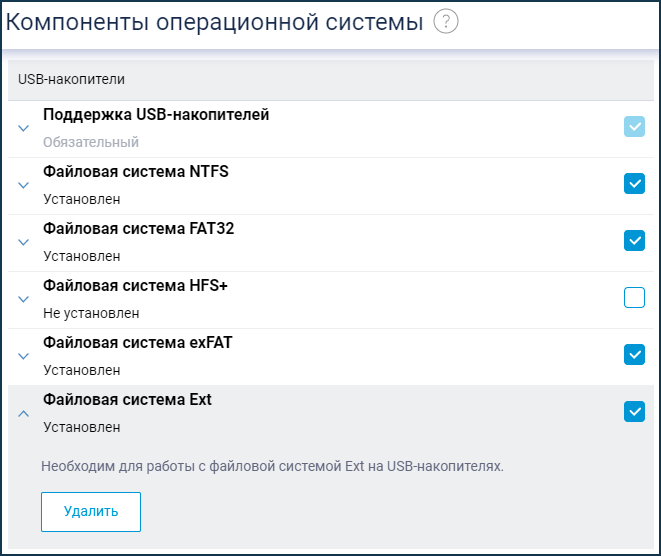
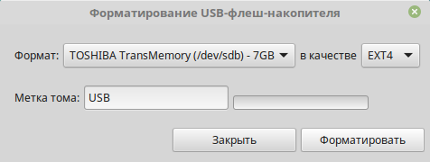
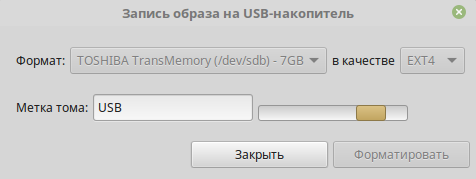
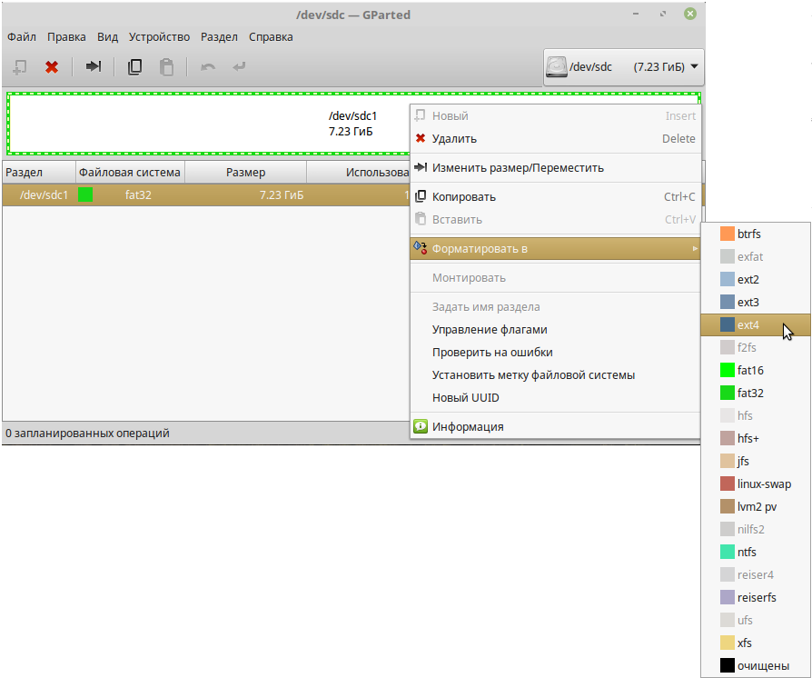
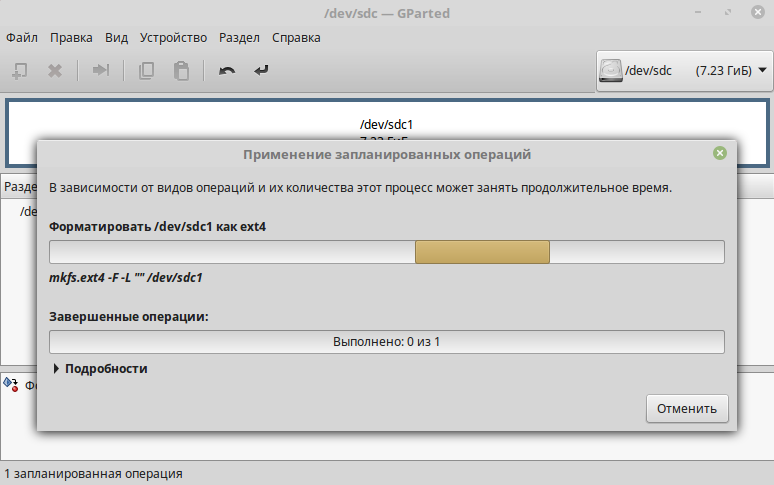
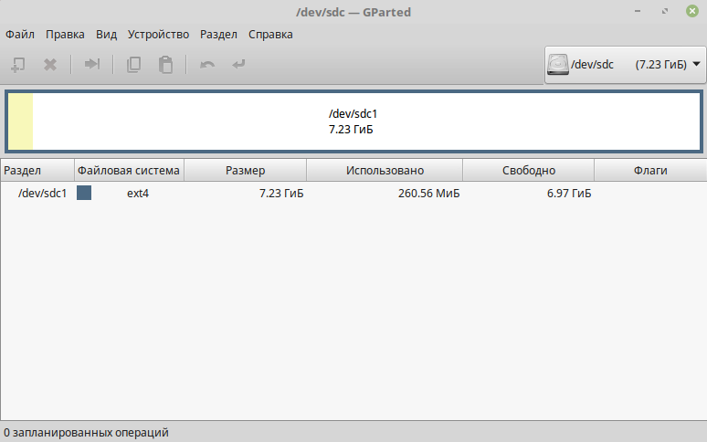
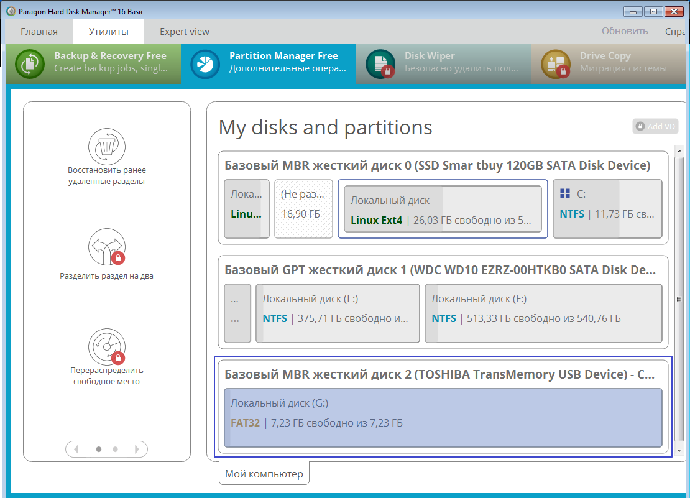
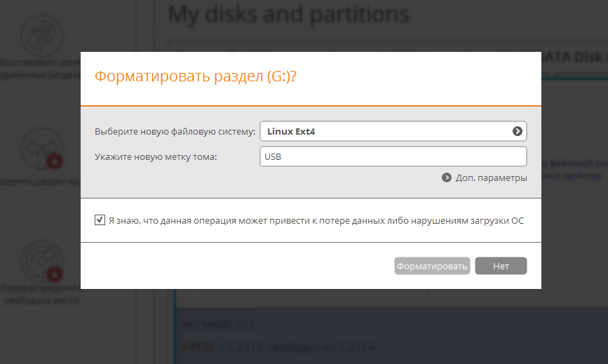
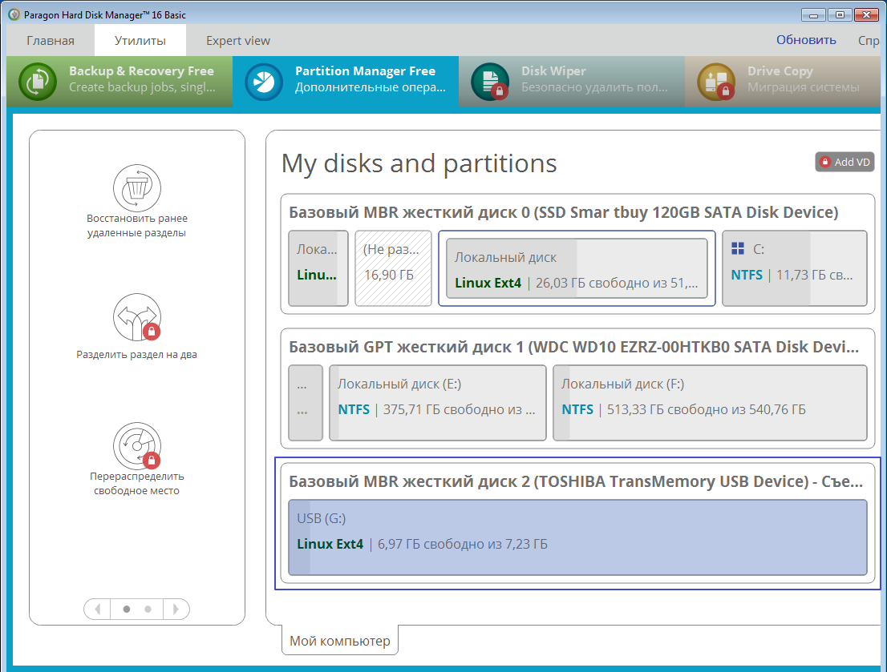

# Использование файловой системы EXT4 на USB-накопителях

2023-12-05
[Оригинальная статья](https://help.keenetic.com/hc/ru/articles/115005875145-%D0%98%D1%81%D0%BF%D0%BE%D0%BB%D1%8C%D0%B7%D0%BE%D0%B2%D0%B0%D0%BD%D0%B8%D0%B5-%D1%84%D0%B0%D0%B9%D0%BB%D0%BE%D0%B2%D0%BE%D0%B9-%D1%81%D0%B8%D1%81%D1%82%D0%B5%D0%BC%D1%8B-EXT4-%D0%BD%D0%B0-USB-%D0%BD%D0%B0%D0%BA%D0%BE%D0%BF%D0%B8%D1%82%D0%B5%D0%BB%D1%8F%D1%85)
```table-of-contents
title: Содержание
style: nestedList # TOC style (nestedList|inlineFirstLevel)
minLevel: 0 # Include headings from the specified level
maxLevel: 0 # Include headings up to the specified level
includeLinks: true # Make headings clickable
debugInConsole: false # Print debug info in Obsidian console
```
На USB-накопителях, подключаемых к интернет-центру Keenetic можно использовать файловую систему EXT4. Данная возможность появилась с версии KeeneticOS 2.07.

Для работы накопителей с файловой системой EXT4 в роутере Keenetic предварительно нужно установить компонент "Файловая система Ext". Сделать это можно на странице "Общие настройки" в разделе "Обновления и компоненты", нажав на "Изменить набор компонентов".



EXT4 — одна из основных файловых систем, используемая преимущественно в операционных системах на ядре Linux. Дополнительную информацию вы можете найти в Интернете: [https://ru.wikipedia.org/wiki/Ext4](https://ru.wikipedia.org/wiki/Ext4)  
По сравнению с EXT3 файловая система EXT4 поддерживает больший размер файлов и файловой системы, является более скоростной, производительной и стабильной системой.

**Важно!**  
В 32-битных системах, которые используются во всех моделях Keenetic (кроме Peak KN-2710, в которой используется ARM64), имеются [ограничения](https://en.wikipedia.org/wiki/Comparison_of_file_systems#Limits) на монтирование и работу с многотерабайтными массивами данных на уровне ядра. В файловой системе EXT4 можно подключить накопители объемом до 16 Тбайт. При подключении дисков объемом свыше 16 Тбайт, можно разделить его на 2 раздела (раздел не должен превышать 16 Тбайт) и тогда эти разделы успешно будут монтироваться в системе.

[Форматирование накопителя](https://ru.wikipedia.org/wiki/%D0%A4%D0%BE%D1%80%D0%BC%D0%B0%D1%82%D0%B8%D1%80%D0%BE%D0%B2%D0%B0%D0%BD%D0%B8%D0%B5_%D0%B4%D0%B8%D1%81%D0%BA%D0%B0) в файловой системе EXT4 рекомендуем выполнять из дистрибутива GNU/Linux средствами операционной системы или с помощью специальных программ и утилит для работы с дисками.

**Важно!**  
При выполнении форматирования накопителя все данные на выбранном носителе будут уничтожены. Перед форматированием обязательно скопируйте нужные данные с накопителя.
### Форматирование в Linux

Обычно в дистрибутиве ОС GNU/Linux имеется какая-нибудь графическая утилита для форматирования USB-накопителей и жестких дисков (например, в Linux Mint — утилита Mintstick, в Ubuntu — Gnome Disk Utility и др.), а также утилита для управления дисками GParted 0.25.0. Можно воспользоваться указанными утилитами для форматирования накопителя или выполнить форматирование из командной строки.

Приведём пример форматирования USB-накопителя (флэшки) с помощью утилиты Mintstick.





Универсальным способом форматирования USB-накопителя является использование утилиты для управления дисками GParted 0.25.0. Обычно она уже установлена в ОС, но при необходимости её можно установить из [официальных репозиториев](https://sourceforge.net/projects/gparted/files/gparted-live-stable/0.25.0-1/) (выполните _sudo apt install gparted_ или _sudo yum install gparted_ в зависимости от дистрибутива).

Запустите GParted 0.25.0. В правом верхнем углу выберите нужное устройство (идентифицировать свой накопитель можно по метке, размеру или файловой системе). Размонтируйте накопитель, чтобы появилась возможность форматирования.







Также форматирование можно выполнить специальными командами через Терминал.  
Один из способов следующий:  
Выполните команду `df` и определите раздел подключенного накопителя (/dev/sdb, /dev/sdc, ...). Предположим, что в нашем примере флэшка находится в */dev/sdc1*.  

Далее её следует отмонтировать. Сделать это можно командой
```shell
sudo umount /dev/sdc1  
```

Теперь, для форматирования её в файловую систему ext4 с меткой "USB", выполните команду
```shell
sudo mkfs.ext4 -n 'USB' -I /dev/sdc1
```

**Важно!**  
1. Накопитель с файловой системой EXT4 нельзя использовать в ОС Windows. Если нужно подключить накопитель с EXT4 в Windows, можно воспользоваться специальным драйвером [ext2fsd](http://www.ext2fsd.com/), разработанным сообществом открытого программного обеспечения для файловых систем семейства ext.  
  
2. Драйвер EXT4 до версии KeeneticOS 2.15 не поддерживает функциональную опцию [metadata_csum](https://ext4.wiki.kernel.org/index.php/Ext4_Metadata_Checksums) (400), которую добавляет новая версия программы GParted при создании раздела. В таком случае рекомендуется создать раздел в Linux-утилите **mkfs.ext4** и выполнить консольную команду без поддержки опции: _sudo mkfs.ext4 -O^metadata_csum -b 4096 -m0 -L MYLABEL /dev/sdc3_, где -L MYLABEL — название раздела диска; /dev/sdc3 — путь до раздела.  
  
3. По умолчанию резервируется 5% от объема раздела или диска для файловой системы EXT4. Например для раздела root. В Linux можно отключить резервирование для раздела при помощи утилиты **tune2fs**: _sudo tune2fs -m 0 /dev/<xxx></code>_, где значение 0 отключает резервирование блоков, а значение 5 — устанавливает резервирование на 5%. Подробности по [ссылке 1](https://help.ubuntu.ru/wiki/ext4) и [ссылке 2](https://qastack.ru/unix/250418/tune2fs-how-much-space-to-reserve-on-large-ext4-filesystem).
### Форматирование в Windows

Как было написано выше, форматирование накопителя в файловой системе EXT4 рекомендуется выполнять из дистрибутива GNU/Linux. Но при необходимости можно произвести форматирование из ОС Windows. Например, можно воспользоваться бесплатной версией программы [Paragon Partition Manager Free](https://www.paragon-software.com/free/pm-express) или [AOMEI Partition Assistant Standard Edition](https://www.diskpart.com/download-home.html).

Приведем пример форматирования накопителя в Paragon Partition Manager Free:







