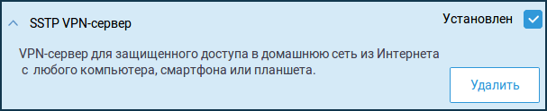
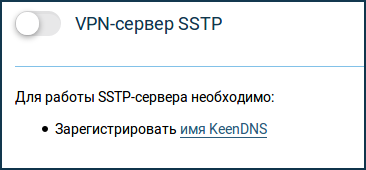
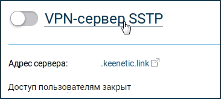
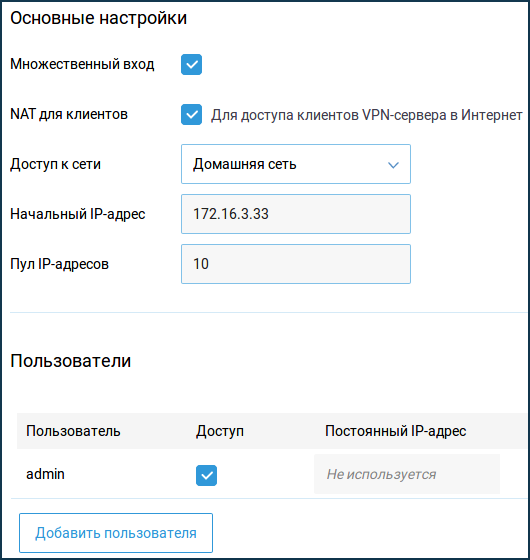
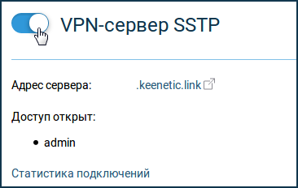
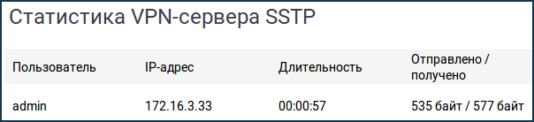

2023-10-06  
[оригинальная статья](https://help.keenetic.com/hc/ru/articles/360000594640-VPN-%D1%81%D0%B5%D1%80%D0%B2%D0%B5%D1%80-SSTP)

В интернет-центре Keenetic можно настроить сервер SSTP. Он позволяет организовать удаленное подключение клиентов к локальной сети интернет-центра.

NOTE: **Важно!** Основным преимуществом туннеля SSTP (Secure Socket Tunnel Protocol) является его способность работать через облако, т.е. он позволяет установить подключение между клиентом и сервером, даже при наличии частных "[серых](https://help.keenetic.com/hc/ru/articles/213965789)" IP-адресов с обеих сторон. Все остальные VPN-сервера требуют наличия публичного "[белого](https://help.keenetic.com/hc/ru/articles/213965789)" IP-адреса.  
Передача данных в SSTP-туннеле происходит при помощи https-трафика.  
Так как сервер SSTP работает через облачные серверы Keenetic Cloud, его скорость зависит от числа пользующихся облаком пользователей и их активности.

Для подключения к SSTP-серверу не требуется установка дополнительных программ в ОС Windows актуальных версий, а в Android потребуется установка дополнительного приложения для подключения к SSTP-серверу интернет-центра. В качестве клиента SSTP может выступать сам Keenetic. Дополнительную информацию вы найдете в статье ["Настройка SSTP-клиента"](https://help.keenetic.com/hc/ru/articles/360000599979).

Для настройки сервера обязательно нужно установить компонент системы "SSTP VPN-сервер". Сделать это можно на странице "Общие настройки" в разделе "Обновления и компоненты", нажав на "Изменить набор компонентов".

После этого перейдите на страницу "Приложения". Здесь вы увидите раздел "VPN-сервер SSTP".

Для работы сервера нужно зарегистрировать интернет-центр в облачной службе KeenDNS, получив имя из домена keenetic.link, keenetic.pro или keenetic.name, поддерживающих работу с сертификатом безопасности SSL. Иначе, подключающийся к серверу клиент не сможет установить доверенное https-соединение. Информацию о том как зарегистрировать имя KeenDNS вы найдете в статье ["Сервис доменных имен KeenDNS"](https://help.keenetic.com/hc/ru/articles/360000400919).

Теперь перейдем к настройке VPN-сервера SSTP.

На странице "Приложения" нажмите по ссылке "VPN-сервер SSTP". 

Выполните настройку сервера.

Параметр "Множественный вход" управляет возможностью устанавливать к серверу несколько одновременных подключений, используя при этом одни и те же учетные данные. Это не является рекомендованным сценарием в связи с понижением уровня безопасности и неудобствами при мониторинге. Однако, при первоначальной настройке, или для случаев, когда требуется разрешить установку туннеля с нескольких устройств одного пользователя, опцию можно оставить включенной.

>**Важно!** При выключенной опции "Множественный вход", появляется возможность назначить постоянный IP-адрес для SSTP-клиента. Сделать это можно на странице настройки VPN-сервера в разделе "Пользователи".

По умолчанию в конфигурации сервера включена опция "NAT для клиентов". Эта настройка служит для доступа клиентов VPN-сервера в Интернет. В клиенте, встроенном в ОС Windows, такая функция включена по умолчанию и при установке туннеля запросы в Интернет будут отправляться через него. В случае режима доступа "Через облако" (настройка сервиса [KeenDNS](https://help.keenetic.com/hc/ru/articles/360000400919)), рекомендуем не использовать настройку "NAT для клиентов", поскольку пропускная способность туннеля при облачном подключении может быть ниже, чем пропускная способность подключения к Интернету сервера, либо клиента.

> **Важно!** Если отключить функцию "NAT для клиентов" на сервере, но не перенастроить политику маршрутизации по умолчанию в Windows-клиенте, то после установки туннеля на компьютере может не работать доступ в Интернет. Дополнительная информация представлена в статье "[Изменение политики маршрутизации VPN-подключения в Windows, при выключенной опции "NAT для клиентов" на сервере](https://help.keenetic.com/hc/ru/articles/360011440700)".

В настройках сервера в поле "Доступ к сети" также можно указать отличный от Домашней сети сегмент, если это необходимо. Через туннель в таком случае будет доступна сеть указанного сегмента.

Общее количество возможных одновременных подключений задается настройкой размера пула IP-адресов. Как и начальный IP-адрес, эту настройку не рекомендуется менять без необходимости.

> **Важно!** Если "Начальный IP-адрес" попадает в диапазон сети указанного в поле "Доступ к сети" сегмента, включается функция ARP-Proxy, что позволит обращаться к такому VPN-клиенту из указанного локального сегмента. Например, если в поле "Доступ к сети" выбрана домашняя сеть 192.168.1.0 с маской 255.255.255.0 и настройками DHCP-сервера: "Начальный адрес пула": 192.168.1.33, "Размер пула адресов": 120, вы можете задать "Начальный IP-адрес" VPN-сервера 192.168.1.154, который попадает в диапазон 192.168.1.1-192.168.1.254, и иметь доступ из домашней сети к VPN-клиентам наравне с доступом к локальным устройствам.

В разделе "Пользователи" выберите пользователей, которым хотите разрешить доступ к SSTP-серверу и в локальную сеть. Здесь же вы можете добавить нового пользователя, указав имя и пароль.

После настройки сервера переведите переключатель в состояние Включено.

Нажав на ссылку "Статистика подключений" вы можете посмотреть статус подключения и дополнительную информацию об активных сессиях.

 

Если вы хотите организовать доступ клиентов не только к локальной сети VPN-сервера, но и в обратную сторону, т.е. из сети VPN-сервера в удаленную сеть VPN-клиента, чтобы обеспечить обмен данными между двумя сторонами VPN-туннеля, обратитесь к инструкции "[Маршрутизация сетей через VPN](https://help.keenetic.com/hc/ru/articles/360001390359)".
