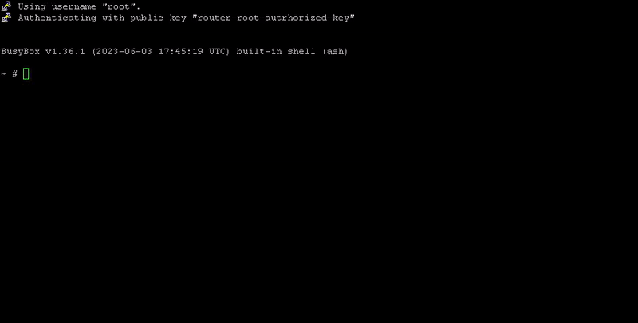
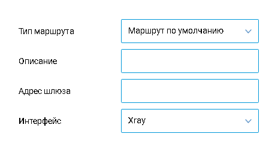
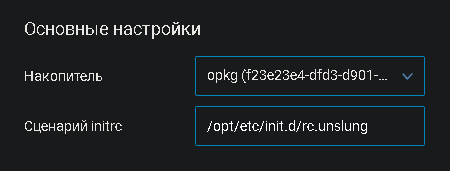

2023-09-10

[Оригинальная статья: Автор Skride](https://habr.com/ru/articles/760052/)  
Весь код написан на чистом shell и открыт на [GitHub](https://github.com/Skrill0/XKeen).  
Пост обновляемый. Всегда актуальная версия на форуме [Keenetic](https://forum.keenetic.com/topic/16899-xray-%D0%BD%D0%B0-entware-xkeen/)

```table-of-contents
title: Содержание
style: nestedList # TOC style (nestedList|inlineFirstLevel)
minLevel: 0 # Include headings from the specified level
maxLevel: 0 # Include headings up to the specified level
includeLinks: true # Make headings clickable
debugInConsole: false # Print debug info in Obsidian console
```
# Что такое Xray

Xray / v2ray — очень гибкая утилита для проксирования и защиты соединения, созданная для обхода GFW (Китайского Файрвола).  
С помощью нее возможно обойти даже блокировки Ирана. Полагаю, что в РФ этого решения хватит на приличное время.

- Решение не будет работать без глубокой настройки в Туркменистане
- Решение не будет работать в КНДР.  
    Там нет интернета в привычном нам понимании
- Решение используется не только для обхода блокировок, но и защиты соединения

# Основные возможности Xray

- Выборочная работа с [DNS](https://xtls.github.io/en/config/dns.html#dns-server) по современным протоколам
    - [DNS over TLS](https://en.wikipedia.org/wiki/DNS_over_TLS)
    - [DNS over HTTPS](https://en.wikipedia.org/wiki/DNS_over_HTTPS)
    - [DNS over Quic](https://www.ietf.org/rfc/rfc9250.html)
 
- Создание собственного DNS — [FakeDNS](https://xtls.github.io/en/config/fakedns.html#fakednsobject)
- Поддержка обратного проксирования — [Reverse Proxy](https://xtls.github.io/en/config/reverse.html)
- Настройка [политик](https://xtls.github.io/en/config/policy.html) для разных пользователей
- [Маршрутизация](https://xtls.github.io/en/config/routing.html#routingobject) поддерживающая
    - [Geoip](https://habr.com/ru/companies/smart_soft/articles/711846/)
    - Geosite — то же самое, что и Geoip, но с доменами.
    - [Регулярные выражения](https://habr.com/ru/articles/545150/)
    - [CIDR](https://en.wikipedia.org/wiki/Classless_Inter-Domain_Routing)
    - Точные совпадения
    - Частичные совпадения
    - Поддомены
 
- Сегментация по правилам и управление входящим трафиком по протоколам
    - [Dokodemo-door](https://xtls.github.io/en/config/inbounds/dokodemo.html)
    - [HTTP](https://xtls.github.io/en/config/inbounds/http.html#inboundconfigurationobject)
    - [ShadowSocks](https://xtls.github.io/en/config/inbounds/shadowsocks.html#inboundconfigurationobject)
    - [Socks](https://xtls.github.io/en/config/inbounds/socks.html#inboundconfigurationobject)
    - [Trojan](https://xtls.github.io/en/config/inbounds/trojan.html#inboundconfigurationobject)
    - [VLESS](https://xtls.github.io/en/config/inbounds/vless.html#inboundconfigurationobject)
    - [VMess](https://xtls.github.io/en/config/inbounds/vmess.html#inboundconfigurationobject)
 
- Сегментация по правилам и управление исходящим трафиком по протокола
    - [Blackhole](https://xtls.github.io/en/config/outbounds/blackhole.html)
    - [DNS](https://xtls.github.io/en/config/outbounds/dns.html#outboundconfigurationobject)
    - [Freedom](https://xtls.github.io/en/config/outbounds/freedom.html#outboundconfigurationobject)
    - [HTTP](https://xtls.github.io/en/config/outbounds/http.html#outboundconfigurationobject)
    - [ShadowSocks](https://xtls.github.io/en/config/outbounds/shadowsocks.html#outboundconfigurationobject)
    - [Socks](https://xtls.github.io/en/config/outbounds/socks.html#outboundconfigurationobject)
    - [Trojan](https://xtls.github.io/en/config/outbounds/trojan.html#outboundconfigurationobject)
    - [VLESS](https://xtls.github.io/en/config/outbounds/vless.html#outboundconfigurationobject)
    - [VMess](https://xtls.github.io/en/config/outbounds/vmess.html#outboundconfigurationobject)
    - [Wireguard](https://xtls.github.io/en/config/outbounds/wireguard.html#outboundconfigurationobject)
 
- Использование современных транспортных протоколов
    - [gRPC](https://xtls.github.io/en/config/transports/grpc.html)
    - [HTTP.2](https://xtls.github.io/en/config/transports/h2.html)
    - [mKCP](https://xtls.github.io/en/config/transports/mkcp.html)
    - [Quic](https://xtls.github.io/en/config/transports/quic.html#headerobject)
    - [TCP](https://xtls.github.io/en/config/transports/tcp.html#tcpobject)
    - [Websocket](https://xtls.github.io/en/config/transports/websocket.html)
 
- Обеспечение защиты транспорта

# Основные возможности Xkeen

Автоматическая сборка актуальной версии Xray под Ваш Keenetic.  
Тестировался на **aarch64**, но гипотетически должен работать и на **mips**, **mipsel.**

**Автоматические обновления**  
Включаются по желанию с возможностью гибкой настройки времени обновления

- Xkeen
- Xray
- GeoSite
- GeoIP

**В утилиту интегрированы**  
Включаются по желанию

- GeoSite
    - [v2fly](https://github.com/v2fly/domain-list-community/)
    - [AntiFilter](https://github.com/schebotar/antifilter-domain)
    - [AntiZapret](https://github.com/warexify/antizapret-xray)
 
- GeoIP
    - [v2fly](https://github.com/Loyalsoldier/v2ray-rules-dat)
    - [AntiFilter](https://github.com/schebotar/antifilter)
# Ключи запуска Xkeen

Пример использования ключей запуска: «xkeen -x», где «-x» — выбранный Вами ключ.

Полный цикл установки  
     `-i` — Необходимые пакеты, Xray и сервисы Xkeen

Обновление  
     `-ux` — Xray  
     `-uk` — Xkeen  
     `-ugs` — GeoSite  
     `-ugi` — GeoIP

Включение или изменение правил обновления  
     `-uac` — Xray, Xkeen, GeoSite, GeoIP  
     `-uxc` — Xray  
     `-ukc` — Xkeen  
     `-ugsc` — GeoSite  
     `-ugic` — GeoIP

Регистрация  
     `-rx` — Xray  
     `-rk` — Xkeen  
     `-ri` — Автоматический запуск Xray средствами init

Удаление  /  Автоматические обновления  
     `-dac` — Xray, Xkeen, GeoSite, GeoIP  
     `-dxc` — Xray  
     `-dkc` — Xkeen  
     `-dgsc` — GeoSite  
     `-dgic` — GeoIP

Удаление  /  Утилиты и компоненты  
     `-dx` — Xray  
     `-dk` — Xkeen  
     `-dgs` — GeoSite  
     `-dgi` — GeoIP  
     `-dс` — Конфигурации Xray  
     `-dt` — Временные файлы

Удаление  /  Регистрации  
     `-drx` —  Xray  
     `-drk` — Xkeen

Обновление регистрации утилит  
     `-rrx` —  Xray  
     `-rrk` — Xkeen

Переустановка  
     `-x `— Xray  
     `-k` — Xkeen  
     `-rc` — Конфигурационные файлы Xray

Резервные копии / Создание  
     `-xb` — Xray  
     `-kb` — Xkeen  
     `-cb` — Конфигурационные файлов Xray

Резервные копии / Восстановление последней  
     `-xbr` — Xray  
     `-kbr` — Xkeen  
     `-cbr` — Конфигурационные файлы Xray

Проверки  
     `-tpc` — Соединение  
     `-tpx `— Порты Xray  
     `-tfx` — Файлы Xray  
     `-tfk` — Файлы Xkeen  
     `-v`  — Версия Xkeen

Управление Xray  
     `-start` — Запуск Xray  
     `-stop` — Остановить Xray  
     `-restart` — Перезапустить Xray  
     `-status` — Показать текущий статус работы Xray

Автор  
     `-ad` — Если Вам полезна утилита, можете купить Мне кофе  
     `-af` — Обратная связь

# Список протестированных устройств

**Giga**
- KN-1010 / Работает
- KN-1011 / Работает
- KN-2410 / Работает

**Ultra**
- KN-1810 / Работает
- KN-1811 / Работает
- KN-2510 / Работает

**Peak**
- KN-2710 / Работает

**Hopper**
- KN-3610 / Работает

**Viva**
- KN-1910 / Работает
- KN-1912 / Работает

**Hero 4G+**
- KN-2311 / Работает

**Giant**
- KN-2610 / Работает 

Если Вашего устройства нет в списке — это не значит, что на нем не будет работать Xkeen.   
Это значит, что не было тестирования на нем. Можете смело попробовать установить на свое устройство.  
Ничего не сломаете.

Если при выполнении команды
```shell
xkeen -start
```

Вы получаете ошибку **похожую** на
```
line 1: can't open html: no such file
line 2: syntax error: unexpected redirection
```

Пожалуйста, сообщите о ней в тему или мне в личные сообщения, с указанием модели Вашего роутера.  
В одном из следующих обновлений ошибка будет исправлена. До того момента поддержки на Ваше устройство нет.
# Способ установки

```shell
opkg install curl tar
cd /tmp
curl -s -L https://github.com/Skrill0/XKeen/releases/latest/download/xkeen.tar --output xkeen.tar && tar -xvf xkeen.tar -C /opt/sbin --overwrite > /dev/null && rm xkeen.tar
xkeen -i
```

1. Выбираем интересующие Вас GeoIP и GeoSite.  
    Можно установить все сразу.
2. Устанавливаем время автоматического обновления.
3. Готово. Вы великолепны.  
    Можете настраивать конфигурации Xray под свои нужды.
    Конфигурационные файлы находятся по пути «/opt/etc/xray/configs/»  
    Некоторые имеют детальное описание. Его можно удалить.

Как выглядит установка в PuTTy


# Полезные ссылки для настройки

[GitHub репозиторий Xray](https://github.com/XTLS/Xray-core)  
[Чат X project в telegram](https://t.me/projectXray) — можно спросить друзей-китайцев.  
Рекомендую писать на английском.

[Быстрый старт от XTLS-Team](https://xtls.github.io/en/document/#download-and-install)  
[Базовое руководство от XTLS-Team](https://xtls.github.io/en/config/)  
[Продвинутое руководство от XTLS-Team](https://xtls.github.io/en/document/level-2/)

[Быстрая настройка сервера на VPS](https://habr.com/ru/articles/735536/)  
[Минималистичная, но более сложная настройка сервера на VPS](https://habr.com/ru/articles/731608/)

[Базовый разбор технологий и протоколов](https://habr.com/ru/articles/727868/)

**Образцы конфигураций**

- [https://github.com/XTLS/Xray-examples](https://github.com/XTLS/Xray-examples)
- [https://github.com/chika0801/Xray-examples](https://github.com/chika0801/Xray-examples)
- [https://github.com/lxhao61/integrated-examples](https://github.com/lxhao61/integrated-examples)

Полезные категории GeoSite

**В GeoSite v2fly нет зоны Ru.**

Реклама
- ext:geosite_v2fly.dat:category-ads-all — Компиляция  
    * EasyList, AdGuard DNS Filter, Peter Lowe,  Dan Pollok
- ext:geosite_v2fly.dat:xiaomitv-ads
- ext:geosite_v2fly.dat:adobe-ads
- ext:geosite_v2fly.dat:apple-ads
- ext:geosite_v2fly.dat:adcolony-ads
- ext:geosite_v2fly.dat:adblock
- ext:geosite_v2fly.dat:adblockplus
- ext:geosite_v2fly.dat:adguard  

Поисковые системы
- ext:geosite_v2fly.dat:duckduckgo
- ext:geosite_v2fly.dat:google
- ext:geosite_v2fly.dat:yandex  

Игры
- ext:geosite_v2fly.dat:xbox
- ext:geosite_v2fly.dat:playstation
- ext:geosite_v2fly.dat:steam
- ext:geosite_v2fly.dat:rockstar
- ext:geosite_v2fly.dat:epicgames
- ext:geosite_v2fly.dat:gog  

Сервисы
- ext:geosite_v2fly.dat:sony
- ext:geosite_v2fly.dat:microsoft
- ext:geosite_v2fly.dat:nvidia
- ext:geosite_v2fly.dat:xiaomi
- ext:geosite_v2fly.dat:category-android-app-download
- ext:geosite_v2fly.dat:openai
- ext:geosite_v2fly.dat:paypal
- ext:geosite_v2fly.dat:ebay
- ext:geosite_v2fly.dat:facebook
- ext:geosite_v2fly.dat:instagram
- ext:geosite_v2fly.dat:youtube
- ext:geosite_v2fly.dat:tiktok
- ext:geosite_v2fly.dat:vk
- ext:geosite_v2fly.dat:telegram
- ext:geosite_v2fly.dat:whatsapp
- ext:geosite_v2fly.dat:adobe
- ext:geosite_v2fly.dat:adobe-activation  

Дополнительные Geo
- ext:geosite_v2fly.dat:category-gov-ru — Государственные сайты РФ
- ext:geosite_antizapret.dat:zapretinfo — Доменные имена списка AntiZapret
- ext:geosite_antifilter.dat:antifilter — Доменные имена списка AntiFilter
- ext:geosite_antifilter.dat:antifilter-community — Доменные имена списка AntiFilter Community

Полезные категории GeoIP

Основной
- ext:geoip_v2fly.dat:ru — зона Ru  

Сервисы
- ext:geoip_v2fly.dat:cloudflare
- ext:geoip_v2fly.dat:cloudfront
- ext:geoip_v2fly.dat:facebook
- ext:geoip_v2fly.dat:fastly
- ext:geoip_v2fly.dat:google
- ext:geoip_v2fly.dat:netflix
- ext:geoip_v2fly.dat:twitter
- ext:geoip_v2fly.dat:telegram
- ext:geoip_v2fly.dat:private  

Дополнительные Geo
- ext:geoip_antifilter.dat:antifilter — Список AntiFilter
- ext:geoip_antifilter.dat:antifilter-community — Список AntiFilter Community

Базовый способ настройки ручной маршрутизации

Помимо GeoIP / GeoSite есть следующие варианты внесения маршрутов

1. Частичное совпадение  
    "vk.com" = "vk.com.ru", "music.vk.com.ru", "www.vk.com/im" ≠ vk.ru
2. Регулярное выражение  
    Пример записи: "regexp:\\.ya.*\\.ru$" = "www.yandex.ru", "mail.yandex.ru" ≠ "ya.ru"  
    Обязательно начинается с "regexp:"
3. Поддомен  
    Пример записи: "domain:keenetic.com" = "forum.keenetic.com" ≠ "forum.keenetic12345.com"
4. Точное совпадение  
    Пример записи: "full:keenetic.com" = "keenetic.com" ≠ "www.keenetic.com", "keenetic123.com"

Пример записи в 10_routing.json

```q
{
  "routing": {
    "rules": {
      "domain": [ //Указываем нужные Вам доменные имена
 "full:keenetic.com", // Точное совпадение
 "domain:keenetic.com", // Поддомен
 "regexp:\\.ya.*\\.ru$", // Регулярное выражение
 "vk.com", // Частичное совпадение
 "ext:geosite_antizapret.dat:ZAPRETINFO" // GeoSite AntiZapret
      ],
      "ip": [ // Указываем нужные Вам IP
 "192.168.1.1", // Точное совпадение
 "10.0.0.0/8", // CIDR
 "ext:geoip_antifilter.dat:antifilter" // GeoIP AntiFilter
      ],
      "outboundTag": "proxy" // Указываем тег подключения, через которое открывать ресурсы
    }
  }
}
```

При использовании встроенного proxy-клиента keenetic

Компонент прокси-клиент из прошивки не поддерживает UDP — Официальный ответ от поддержки Keenetic

1. В политиках не поднимайте proxy-подключение выше основного     
    * Если поднимаете надо прописать путь до VPS-сервера в маршрутах. Спасибо [Artem Laptev](https://t.me/Leshiyart)
2. Применяйте proxy-политику к конкретным клиентам
3. В Proxy-подключении должно быть включено «Использовать для выхода в интернет»
4. Не работает «localhost» в настройках прокси-клиента Keenetic.   
    Спасибо [Artem Laptev](https://t.me/Leshiyart)  
     * Вероятно, особенность реализации прокси-клиента
5. На прошивках ниже 4.× через созданное прокси-подключение нужно проложить маршрут, как на скриншоте ниже. Спасибо [Artem Laptev](https://t.me/Leshiyart).



Настройки маршрута в Web роутера

На данном этапе встроенный прокси-клиент — самый простой способ направить соединение на Xray.  
В **99%** случаев нет смысла возиться с tproxy / dokodemo-door или маркировать трафик UDP/TCP.

Прокси-клиент Keenetic направляет соединение на Xray, поднятый на роутере. И только потом, к примеру, на соединение с VPS.   
Xray также завернет Ваш трафик в то, что Вы указали в его конфигурации.  
К примеру, в TCP. Т.к. соединение клиента и сервера должно иметь идентичную конфигурацию. В противном случае Ваш трафик будет распознан, как «чужой».

Сохраняем комфорт даже при мобильной сети

После настроенного на роутере Xray — его можно использовать в качестве портала.  
При этом дополнительные настройки конфигурации не нужны.  
  
Вот 2 способа решения задачи  
1. IKE подключением по инструкции [Keenetic](https://help.keenetic.com/hc/ru/articles/360017022999-VPN-%D1%81%D0%B5%D1%80%D0%B2%D0%B5%D1%80-IKEv2)  
2. SSTP подключением по инструкции [Keenetic](https://help.keenetic.com/hc/ru/articles/360000594640-VPN-%D1%81%D0%B5%D1%80%D0%B2%D0%B5%D1%80-SSTP) / Спасибо [@Alexey77](https://forum.keenetic.com/profile/69772-alexey77/)

Способ удаления

```shell
opkg remove xkeen
opkg remove xray
```

Удаленить backups в «/opt/»  
* Если не требуются резервные копии Xray / Xkeen / Ваших конфигураций.

Известные проблемы
1. ~~Неправильно определяется модель процессора~~ **~~MIPS 1004Kc~~ Исправлено**
2. Неправильно компилируется Xray на процессоры **MIPS 24kc В работе**
3. ~~Не работает ключ -tpx~~  **Исправлено**
4. ~~Некорректно работает выбор отдельных GeoIP~~  **Исправлено**

Если не работает автозапуск Xray при включении роутера или автоматические обновления

Проверьте, что у Вас указан путь до инициатора автозагрузок Entware в Web роутера. Это делается следующим образом
1. Заходим в интерфейс через шлюз роутера. По стандарту это 192.168.1.1
2. Управление > OPKG
3. Проверяем поле «Сценарий initrc» Оно должно иметь следующее содержимое

```shell
/opt/etc/init.d/rc.unslung
```


# Часто задаваемые вопросы

Можно организовать соединение через warp?*
- Да [Руководство на английском](https://xtls.github.io/en/document/level-2/warp.html#applying-for-a-warp-account)

**Можно организовать соединение через порталы?**
- Да [Reverse proxy](https://xtls.github.io/en/config/reverse.html)

**Можно создать разные списки для разных VPS серверов?**
- Да У каждого соединения (outbounds) есть свой tag. В routing ссылайтесь в нужном Вам списке маршрутов на этот tag. Маршруты будут открываться через указанный tag VPS.

**Можно ли использовать без собственного VPS?**
- Да Некоторые VPN сервисы предлагают ограниченное в настройке соединение через Xray. Пример: [Mullvad](https://mullvad.net/en/help/xtls-with-mullvad-vpn), XKeen
