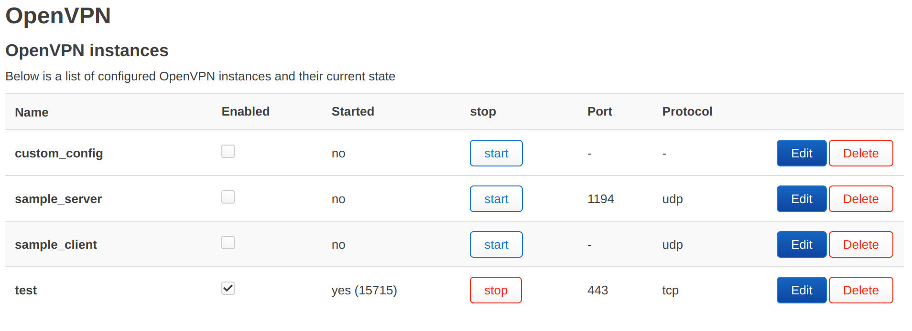
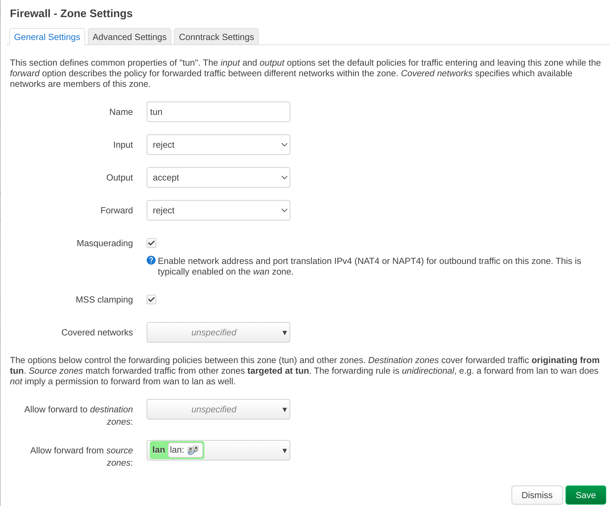

2023-06-22

[Оригинальная статья](https://itdog.info/nastrojka-klienta-openvpn-na-openwrt/)

---
```table-of-contents
title: Содержание:
style: nestedList # TOC style (nestedList|inlineFirstLevel)
minLevel: 0 # Include headings from the specified level
maxLevel: 0 # Include headings up to the specified level
includeLinks: true # Make headings clickable
debugInConsole: false # Print debug info in Obsidian console
```
---

Здесь рассматривается, как настроить роутер с OpenWrt в качестве клиента сервера OpenVPN.

- Всё проделывается на OpenWrt 22.03.5. На других версиях настройка не отличается
- Предполагается, что уже есть работающий клиентский конфиг
- Туннель можно настроить через консоль и через LuCi

Установка пакета

```shell
opkg update && opkg install openvpn-openssl
```

Настройка состоит из копирования конфига на роутер, создании зоны для OpenVPN и разрешения на передачу трафика из зоны lan в зону tun.

## Настройка через консоль, копирование конфига

Тут всё довольно просто: есть специальная директория `/etc/openvpn/`, в которую можно просто закинуть свой конфиг и при старте OpenVPN возьмёт его и поднимет туннель.  
Конфиг клиента openvpn копируем в `/etc/openvpn/client.conf`

Например, через scp

```shell
scp client.ovpn root@192.168.1.1:/etc/openvpn/client.conf
```

В клиентские файлы конфигурации обычно складываются сразу настройки подключения, сертификаты и ключи. Проверьте, что там это всё есть.

Стартуем openvpn

```shell
service openvpn start
```

Проверяем, что интерфейс поднялся. По умолчанию это будет `tun0`

```q
root@OpenWrt:/etc/openvpn# ip a
1: lo: <LOOPBACK,UP,LOWER_UP> mtu 65536 qdisc noqueue state UNKNOWN qlen 1000
...
6: tun0: <POINTOPOINT,MULTICAST,NOARP,UP,LOWER_UP> mtu 1500 qdisc fq_codel state UNKNOWN qlen 500
    link/[65534] 
    inet 10.12.0.2/24 scope global tun0
       valid_lft forever preferred_lft forever
...
```

Проверить, что туннель работает, можно простым пингом с указанием интерфейса

```shell
ping -I tun0 itdog.info
```

Для того чтобы клиенты роутера могли ходить через туннель, необходимо добавить зону для интерфейса openvpn и разрешить forwarding из lan зоны в `/etc/config/firewall`

```q
config zone
        option name 'tun'
        option forward 'REJECT'
        option output 'ACCEPT'
        option input 'REJECT'
        option masq '1'
        option mtu_fix '1'
        option device 'tun0'
        option family 'ipv4'

config forwarding
        option name 'lan-tun'
        option dest 'tun'
        option src 'lan'
        option family 'ipv4'
```

Логика такая же, как для WG, но есть одно но. Для WG мы указываем интерфейс через опцию network, потому что WG интерфейс определён в `/etc/config/network`. А для openvpn указываем device, потому что openvpn сам создаёт этот интерфейс, и в network его нет.

После этого нужно перезапустить firewall

```shell
service firewall restart
```

## Настройка через LuCi

Для управления через LuCi. Понадобится ещё пакет для этого. Установка через консоль

```shell
opkg install luci-app-openvpn
```

Чтоб установить через LuCi, надо зайти в **System - Software**. В поле **Download and install package** ввести имя пакета `luci-app-openvpn` и нажать кнопку **Install**  
И если у вас не установлен основной пакет, то нужно установить и его `openvpn-openssl`.  
Зайти в **VPN - OpenVPN**. В **OVPN configuration file upload** нажать кнопку **Choose file** и выбрать свой конфиг, ввести какое-нибудь имя для него в поле **Instance name** и нажать кнопку **Upload**.  
Этот конфиг должен появиться в **OpenVPN instances**. Включить его галочкой **Enabled** и Save & Apply.



В столбце **Started** должен появиться статус **yes**. С помощью Stop/Start можно останавливать и стартовать туннель.  
Чтоб редактировать конфиг, нужно нажать **Edit**, внести изменения и нажать Save.

### Добавление zone и forwarding через LuCi

Зайти в **Network - Firewall**, промотать до **Zones**. Нажать кнопку **Add**

Заполнить вкладку:

**Name** - tun  
**Input** - reject  
**Output** - accept  
**Forward** - reject  
**Masquerading** - проставить галочку  
**MSS clamping** - проставить галочку  
**Allow forward from source zones** - lan



Save - Save & Apply

## Перенаправление всего трафика в туннель

За перенаправление всего трафика в OpenVPN отвечает директива `redirect-gateway`. Она может находиться в вашем клиентском конфиге, либо сам OpenVPN сервер может проставлять соединению без вашего спроса.  
Проверить, идёт ли весь трафик в туннель на роутере, можно через `traceroute` к любому незаблокированному ресурсу

```q
root@OpenWrt:~# traceroute itdog.info
traceroute to itdog.info (95.217.5.75), 30 hops max, 46 byte packets
 1  10.12.0.1 (10.4.0.1)  67.590 ms  66.855 ms  67.474 ms
 2  172.31.1.1 (172.31.1.1)  71.196 ms  70.921 ms  70.797 ms
```

Если на первом месте не IP роутера, а незнакомый IP (или знакомый, если vpn сервер ваш), то трафик идёт через туннель.  
Также можно посмотреть таблицу маршрутизации

```q
root@OpenWrt:~# ip r
0.0.0.0/1 via 10.8.0.1 dev tun0 
```

Эта строка означает, что весь трафик идёт в интерфейс `tun0`. А `tun0` это интерфейс OpenVPN, в этом случае.  
В случае, если вам не нужно перенаправлять весь трафик в туннель, а это происходит, проверьте в первую очередь ваш конфиг.  
Если присутствует `redirect-gateway`, то нужно выпилить эту директиву.   
Если в клиентском конфиге она отсутствует, но маршрут всё равно прописывается и весь трафик идёт в туннель, то в конфиге клиента добавляем строку

```shell
pull-filter ignore redirect-gateway
```

Это может выглядеть так

```q
verb 3
pull-filter ignore redirect-gateway
<ca>
-----BEGIN CERTIFICATE-----
```

Она будет игнорировать настройку сервера.  
Делаем рестарт openvpn, либо из LuCi, либо из командной строки

```shell
service openvpn restart
```

## Настройка с помощью конфигурации OpenWrt

Конфигурация лежит в `/etc/config/openvpn`. Там есть уже готовые примеры.  
Также можно вручную задать в LuCi все настройки. Для этого в **Template based configuration** выбрать **Client configuration…**, задать имя и нажать **Add**. После этого созданный instance редактировать с помощью кнопки **Edit**.  
Это сложнее, чем копирование файла конфигурации. Помимо настройки конфига, нужно копировать на роутер 2 сертификата и 2 ключа. Поэтому подробно рассматривать этот вариант не буду.
### Переключение роутинга на OpenVPN

Речь идёт про [мой способ роутинга](https://itdog.info/tochechnaya-marshrutizaciya-po-domenam-na-routere-s-openwrt/) .  
Тут есть два варианта, в зависимости от того по какой инструкции вы делали маршрут для таблицы vpn
#### Новый вариант через /etc/confg/network

В `/etc/config/network` в правиле

```q
config interface 'vpn0'
	option name 'vpn0'
	option proto 'none'
	option auto '1'
	option device 'tun0'

config route 'vpn_route'
	option name 'vpn_route'
	option interface 'vpn0'
	option table 'vpn'
	option target '0.0.0.0/0'
```

у вас должен быть указать tun0, а не wg0. И так же создан интерфейс прослойка vpn0.

#### Старый вариант через hotplug

В файле `/etc/hotplug.d/iface/30-vpnroute` меняем интерфейс с **wg0** на **tun0**.  
У меня во время тестов не всегда поднимался маршрут при рестарте роутера. Это означает, что интерфейс openvpn поднимался после того, как отрабатывал hotplug. Решается это простой задержкой

```shell
#!/bin/sh

sleep 10
ip route add table vpn default dev tun0
```

После этого рестартуем сеть, и роутинг теперь осуществляется через openvpn

```shell
/etc/init.d/network restart
