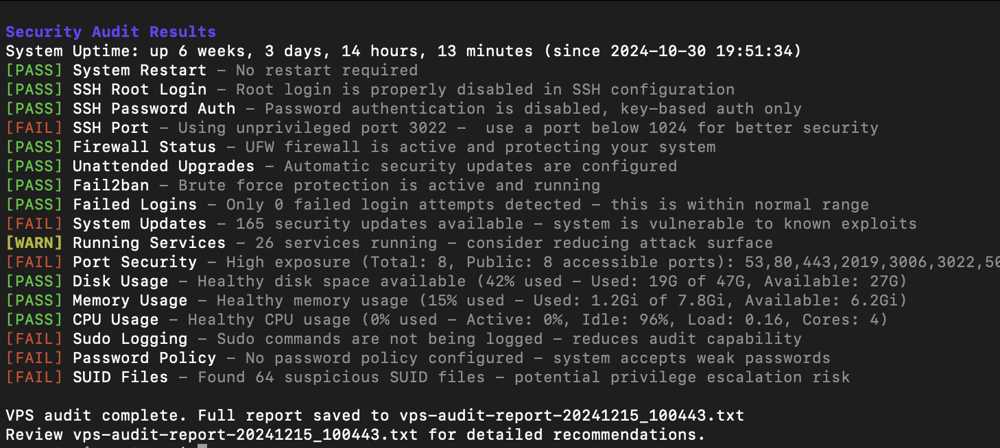

# VPS Security Audit Script

[Источник](https://github.com/Acenotass/vps-audit?tab=readme-ov-file#vps-security-audit-script)

```table-of-contents
title: Содержание
style: nestedList # TOC style (nestedList|nestedOrderedList|inlineFirstLevel)
minLevel: 0 # Include headings from the specified level
maxLevel: 0 # Include headings up to the specified level
includeLinks: true # Make headings clickable
hideWhenEmpty: false # Hide TOC if no headings are found
debugInConsole: false # Print debug info in Obsidian console
```


Полноценный скрипт на Bash для аудита безопасности и производительности вашего VPS (Виртуального частного сервера). Этот инструмент проводит различные проверки безопасности и предоставляет подробный отчет с рекомендациями по улучшению.

[](https://github.com/Acenotass/vps-audit/blob/main/screenshot.png)
## Функции

### Проверки безопасности

- Настройка SSH
    - Статус входа под рутом
    - Авторизация по паролю
    - Использование нестандартного порта
- Статус файрвола (UFW)
- Конфигурация Fail2ban
- Неудачные попытки входа в систему
- Статус обновлений системы
- Анализ запущенных служб
- Детектирование открытых портов
- Настройка журналирования sudo
- Выполнение политики паролей
- Обнаружение файлов SUID

### Мониторинг производительности

- Использование дискового пространства
- Использование памяти
- Использование процессора (CPU)
- Активные соединения в Интернете.

## Требования

- Система на основе Ubuntu/Debian (Linux)
- Права администратора или привилегии sudo
- Основные пакеты (большинство из которых предустановлены):
    - ufw
    - systemd
    - netstat
    - grep
    - awk

## Установка

1. Скачать скрипт:

```shell
wget https://raw.githubusercontent.com/vernu/vps-audit/main/vps-audit.sh
# or
curl -O https://raw.githubusercontent.com/vernu/vps-audit/main/vps-audit.sh
```

2. Сделать скрипт исполняемым:

```shell
chmod +x vps-audit.sh
```

## Использование

Запустите скрипт с правами суперпользователя (sudo).:

```shell
sudo ./vps-audit.sh
```

Скрипт будет:

1. Выполнять все проверки безопасности.
2. Показывать результаты в реальном времени с цветным кодированием:
    - 🟢 [PASS] - проверка прошла успешно
    - 🟡 [WARN] - потенциальные проблемы обнаружены
    - 🔴 [FAIL] - критические проблемы найдены
3. Создавать подробный журнал: `vps-audit-report-[TIMESTAMP].txt`

## Формат вывода

Скрипт обеспечивает два типа вывода:

1. В реальном времени консольный вывод с цветным кодированием.:

```
[PASS] SSH Root Login - Root login is properly disabled in SSH configuration
[WARN] SSH Port - Using default port 22 - consider changing to a non-standard port
[FAIL] Firewall Status - UFW firewall is not active - your system is exposed
```

2. Детальный журнал, содержит:

- Все результаты проверок
- Специальные рекомендации для неудачных проверок
- Статистику использования системных ресурсов
- Время отметки аудита

## Пороги

### Требования к использованию ресурсов

- PASS: < 50% usage
- WARN: 50-80% usage
- FAIL: > 80% usage

### Требования безопасности

- Недавние попытки входа:
    - PASS: < 10 attempts
    - WARN: 10-50 attempts
    - FAIL: > 50 attempts
- Безопасность и управление.
    - PASS: < 20 services
    - WARN: 20-40 services
    - FAIL: > 40 services
- Открытые порты (англ. Open ports):
    - PASS: < 10 ports
    - WARN: 10-20 ports
    - FAIL: > 20 ports

## Настройка

You can modify the thresholds by editing the following variables in the script:

- Resource usage thresholds
- Failed login attempt thresholds
- Service count thresholds
- Open port thresholds

## Лучшие практики

1. Регулярно проводите аудит (например, еженедельно), чтобы поддерживать безопасность.
2. Оцените тщательно сгенерированный отчет.
3. Обратите внимание на статус FAIL как можно скорее.
4. Проверьте статус WARN во время обслуживания.
5. Обновляйте скрипт согласно вашим политикам безопасности.

## Ограничения

- Для систем на основе Debian/Ubuntu
- Обязателен доступ администратора (root или sudo)
- Некоторые проверки могут требовать настройки для конкретной среды
- Не является заменой профессионального аудита безопасности.

## Вклад

Всегда готовы принять заявки на ошибки и улучшения!

## Лицензия

Этот проект лицензируется по условиям лицензии MIT - смотрите файл LICENSE для подробной информации.

## Предупреждение о безопасности

Хотя этот скрипт помогает выявить общие проблемы безопасности, он не должен быть единственным мерой безопасности. Всегда:

- Обновляйте систему.
- Регулярно проверяйте журналы.
- Следуйте лучшим практикам безопасности.
- Рассчитайте на профессиональные аудиты безопасности для критических систем.