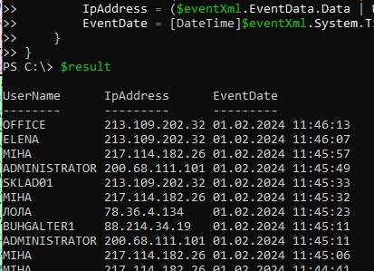
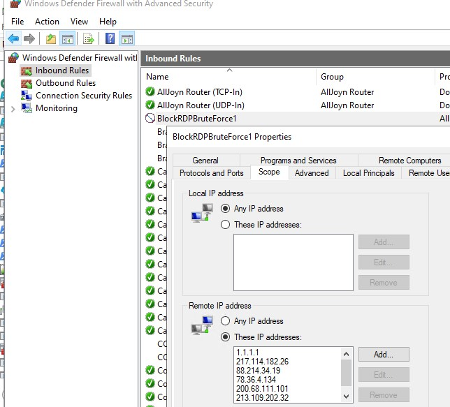
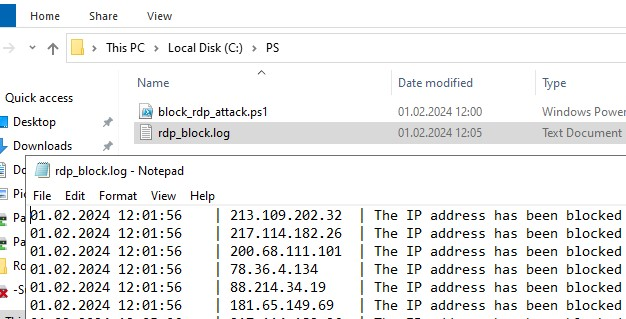
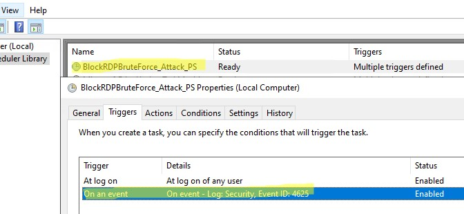

 2024-02-15
[Оригинальная статья](https://winitpro.ru/index.php/2019/10/02/blokirovka-rdp-atak-firewall-powershell/)

Tags: [PowerShell](https://winitpro.ru/index.php/category/powershell/), [Windows 10](https://winitpro.ru/index.php/category/windows-10/), [Windows Server 2019](https://winitpro.ru/index.php/category/windows-server-2019/), [Windows Server 2022](https://winitpro.ru/index.php/category/windows-server-2022/)

На любом хосте Windows, напрямую подключённом к Интернету, с открытым наружу портом RDP периодически будут фиксироваться попытки удаленного перебора паролей. Для эффективной защиты стандартного RDP порта `3389` от перебора паролей и эксплуатации уязвимостей рекомендуется разместить RDP сервер за VPN или [шлюзом RD Gateway](https://winitpro.ru/index.php/2022/03/17/nastrojka-shlyuza-remote-desktop-gateway-windows-server/). Если реализовать такую схему невозможно, нужно внедрять дополнительные средства для защиты RDP:

- Не использовать стандартные имена учетных записей в Windows (если это не сделать, популярные имена учетных записей { `admin` , `administrator` , `user1` }будут периодически [блокироваться](https://winitpro.ru/index.php/2014/05/07/poisk-istochnika-blokirovki-uchetnoj-zapisi-polzovatelya-v-active-directory/) в соответствии с настройками [политики паролей Windows](https://winitpro.ru/index.php/2018/10/26/politika-parolej-uchetnyx-zapisej-v-active-directory/));
- Использовать [сложные политики паролей пользователей](https://winitpro.ru/index.php/2018/10/26/politika-parolej-uchetnyx-zapisej-v-active-directory/);
- [Изменить стандартный RDP порт 3389](https://winitpro.ru/index.php/2010/09/17/nomer-porta-rdp-v-windows/) на другой;
- Настроить 2FA для RDP входа (пример [настройки двухфакторной аутентификации для RDP с помощью open-source multiOTP](https://winitpro.ru/index.php/2022/01/18/2fa-v-windows-multiotp/)).

В этой статье мы настроим автоматическую блокировку IP адресов, с которых выполняются неудачные попытки RDP аутентификации.

## PowerShell скрипт для блокировки IP адресов-источников RDP атак

При неудачной попытке аутентификации в Windows по RDP в журнале событий Security регистрируется событие с EventID 4625 (неудачный вход — `An account failed to log on` и `LogonType = 3` , см. статью [Анализ RDP логов в Windows](https://winitpro.ru/index.php/2018/09/25/analizing-rdp-logs-windows-terminal-rds/) ). В описании события указано имя пользователя, под которым выполнялась попытка подключения и IP адрес источника.

Можно вывести список таких событий с неудачными попытками входа за последний час по с помощью PowerShell командлета [Get-WinEvent](https://winitpro.ru/index.php/2022/11/16/poisk-sobytij-event-log-powershell/):  
```powershell
$result = Get-WinEvent -FilterHashtable @{LogName='Security';ID=4625; EndTime=(get-date).AddHours(-1)} |
ForEach-Object {
$eventXml = ([xml]$_.ToXml()).Event
[PsCustomObject]@{
UserName = ($eventXml.EventData.Data | Where-Object { $_.Name -eq 'TargetUserName' }).'#text'
IpAddress = ($eventXml.EventData.Data | Where-Object { $_.Name -eq 'IpAddress' }).'#text'
EventDate = [DateTime]$eventXml.System.TimeCreated.SystemTime
}
}
$result
```



С помощью PowerShell скрипта можно анализировать этот лог, и, если с конкретного IP адреса за последние 2 часа было зафиксировано более 5 неудачных попыток входа по RDP, IP адрес будет добавлен в блокирующее правило Windows Firewall.

```powershell
# количество неудачных попыток входа с одного IP адреса, при достижении которого нужно заблокировать IP
$badAttempts = 5
# Просмотр лога за последние 2 часа
$intervalHours = 2
# Если в блокирующем правиле более 3000 уникальных IP адресов, создать новое правило Windows Firewall
$ruleMaxEntries = 3000
# номер порта, на котором слушает RDP
$RdpLocalPort=3389
# файл с логом работы PowerShell скрипта
$log = "c:\ps\rdp_block.log"
# Список доверенных IP адресов, которые нельзя блокировать
$trustedIPs = @("192.168.1.100", "192.168.1.101","8.8.8.8")  
 $startTime = [DateTime]::Now.AddHours(-$intervalHours)
$badRDPlogons = Get-EventLog -LogName 'Security' -After $startTime -InstanceId 4625 |
    Where-Object { $_.Message -match 'logon type:\s+(3)\s' } |
    Select-Object @{n='IpAddress';e={$_.ReplacementStrings[-2]}}
$ipsArray = $badRDPlogons |
    Group-Object -Property IpAddress |
    Where-Object { $_.Count -ge $badAttempts } |
    ForEach-Object { $_.Name }
# Удалить доверенные IP адреса 
$ipsArray = $ipsArray | Where-Object { $_ -notin $trustedIPs }
if ($ipsArray.Count -eq 0) {
    return
}
[System.Collections.ArrayList]$ips = @()
[System.Collections.ArrayList]$current_ip_lists = @()
$ips.AddRange([string[]]$ipsArray)
$ruleCount = 1
$ruleName = "BlockRDPBruteForce" + $ruleCount
$foundRuleWithSpace = 0
while ($foundRuleWithSpace -eq 0) {
    $firewallRule = Get-NetFirewallRule -DisplayName $ruleName -ErrorAction SilentlyContinue
    if ($null -eq $firewallRule) {
  New-NetFirewallRule -DisplayName $ruleName –RemoteAddress 1.1.1.1 -Direction Inbound -Protocol TCP –LocalPort $RdpLocalPort -Action Block
        $firewallRule = Get-NetFirewallRule -DisplayName $ruleName
        $current_ip_lists.Add(@(($firewallRule | Get-NetFirewallAddressFilter).RemoteAddress))
        $foundRuleWithSpace = 1
    } else {
        $current_ip_lists.Add(@(($firewallRule | Get-NetFirewallAddressFilter).RemoteAddress))        
        if ($current_ip_lists[$current_ip_lists.Count – 1].Count -le ($ruleMaxEntries – $ips.Count)) {
            $foundRuleWithSpace = 1
        } else {
            $ruleCount++
            $ruleName = "BlockRDPBruteForce" + $ruleCount
        }
    }
}
# Удалить IP адреса, которые уже есть в правиле 
for ($i = $ips.Count – 1; $i -ge 0; $i--) {
    foreach ($current_ip_list in $current_ip_lists) {
        if ($current_ip_list -contains $ips[$i]) {
            $ips.RemoveAt($i)
            break
        }
    }
}
if ($ips.Count -eq 0) {
    exit
}
# Заблокировать IP в firewall и записать в лог
$current_ip_list = $current_ip_lists[$current_ip_lists.Count – 1]
foreach ($ip in $ips) {
    $current_ip_list += $ip
    (Get-Date).ToString().PadRight(22) + ' | ' + $ip.PadRight(15) + ' | The IP address has been blocked due to ' + ($badRDPlogons | Where-Object { $_.IpAddress -eq $ip }).Count + ' failed login attempts over ' + $intervalHours + ' hours' >> $log
}
Set-NetFirewallRule -DisplayName $ruleName -RemoteAddress $current_ip_list
```

В русской версии Windows этот скрипт не будет работать, т.к. расчитан на ENG редакцию. Для адаптации скрипт под русскую Windows замените строку:

`$badRDPlogons = Get-EventLog -LogName ...`

На блок кода:

```powershell
$ipPattern = '\b(?:\d{1,3}\.){3}\d{1,3}\b'
$badRDPlogons = @()
$events = Get-WinEvent -FilterHashTable @{LogName='Microsoft-Windows-RemoteDesktopServices-RdpCoreTS/Operational';ID='140';StartTime=$startTime}
$events.message | ForEach-Object {
if ($_ -match $ipPattern) {
$ipObject = [PSCustomObject]@{
IpAddress = $matches[0]
}
$badRDPlogons += $ipObject
}
}
```
  
После запуска [PoweShell скрипт создаст правило в Windows Defender Firewall](https://winitpro.ru/index.php/2019/09/25/upravlenie-windows-firewall-powershell/), которое заблокирует подключение к RDP порту для полученного списка IP адресов.



В [лог файл скрипт PowerShell будет записывать](https://winitpro.ru/index.php/2021/03/15/logirovanie-powershell-scriptov/) список заблокированных IP:



Готовый скрипт **block_rdp_attack.ps1** можно скачать с GitHub: [https://github.com/winadm/posh/blob/master/RemoteDesktop/block_rdp_attack.ps1](https://github.com/winadm/posh/blob/master/RemoteDesktop/block_rdp_attack.ps1)

Чтобы скачать PS1 скрипт с GitHub на локальный диск, выполните:

```powershell
$path = "C:\PS\"
If(!(test-path -PathType container $path))
{
      New-Item -ItemType Directory -Path $path
}
$url = "https://raw.githubusercontent.com/winadm/posh/master/RemoteDesktop/block_rdp_attack.ps1"
$output = "$path\block_rdp_attack.ps1" 
Invoke-WebRequest -Uri $url -OutFile $output
```

скачанный скрипт
```powershell
# скрипт для блокировки IP адресов, с которых идут попытки RDP подключений с перебором паролей
# Подробности здесь: https://winitpro.ru/index.php/2019/10/02/blokirovka-rdp-atak-firewall-powershell/
# количество неудачных попыток входа с одного IP адреса, при достижении которого нужно заблокировать IP
$badAttempts = 5
# Просмотр лога за последние 2 часа
$intervalHours = 2
# Если в блокирующем правиле более 3000 уникальных IP адресов, создать новое правило Windows Firewall
$ruleMaxEntries = 3000
# номер порта, на котором слушает RDP
$RdpLocalPort=3389
# файл с логом работы PowerShell скрипта
$log = "c:\ps\rdp_block.log"
# Список доверенных IP адресов, которые нельзя блокировать
$trustedIPs = @("192.168.1.100", "192.168.1.101","8.8.8.8")  

$startTime = [DateTime]::Now.AddHours(-$intervalHours)
$badRDPlogons = Get-EventLog -LogName 'Security' -After $startTime -InstanceId 4625 |
    Where-Object { $_.Message -match 'logon type:\s+(3)\s' } |
    Select-Object @{n='IpAddress';e={$_.ReplacementStrings[-2]}}
$ipsArray = $badRDPlogons |
    Group-Object -Property IpAddress |
    Where-Object { $_.Count -ge $badAttempts } |
    ForEach-Object { $_.Name }

# Удалить доверенные IP адреса 
$ipsArray = $ipsArray | Where-Object { $_ -notin $trustedIPs }


if ($ipsArray.Count -eq 0) {
    return
}
[System.Collections.ArrayList]$ips = @()
[System.Collections.ArrayList]$current_ip_lists = @()
$ips.AddRange([string[]]$ipsArray)
$ruleCount = 1
$ruleName = "BlockRDPBruteForce" + $ruleCount
$foundRuleWithSpace = 0

while ($foundRuleWithSpace -eq 0) {
    $firewallRule = Get-NetFirewallRule -DisplayName $ruleName -ErrorAction SilentlyContinue
    if ($null -eq $firewallRule) {
        New-NetFirewallRule -DisplayName $ruleName –RemoteAddress 1.1.1.1 -Direction Inbound -Protocol TCP –LocalPort $RdpLocalPort -Action Block
        $firewallRule = Get-NetFirewallRule -DisplayName $ruleName
        $current_ip_lists.Add(@(($firewallRule | Get-NetFirewallAddressFilter).RemoteAddress))
        $foundRuleWithSpace = 1
    } else {
        $current_ip_lists.Add(@(($firewallRule | Get-NetFirewallAddressFilter).RemoteAddress))
        
        if ($current_ip_lists[$current_ip_lists.Count – 1].Count -le ($ruleMaxEntries – $ips.Count)) {
            $foundRuleWithSpace = 1
        } else {
            $ruleCount++
            $ruleName = "BlockRDPBruteForce" + $ruleCount
        }
    }
}
# Удалить IP адреса, которые уже есть в правиле 
for ($i = $ips.Count – 1; $i -ge 0; $i--) {
    foreach ($current_ip_list in $current_ip_lists) {
        if ($current_ip_list -contains $ips[$i]) {
            $ips.RemoveAt($i)
            break
        }
    }
}

if ($ips.Count -eq 0) {
    exit
}

# Заблокировать IP в firewall и записать в лог
$current_ip_list = $current_ip_lists[$current_ip_lists.Count – 1]
foreach ($ip in $ips) {
    $current_ip_list += $ip
    (Get-Date).ToString().PadRight(22) + ' | ' + $ip.PadRight(15) + ' | The IP address has been blocked due to ' + ($badRDPlogons | Where-Object { $_.IpAddress -eq $ip }).Count + ' failed login attempts over ' + $intervalHours + ' hours' >> $log
}

Set-NetFirewallRule -DisplayName $ruleName -RemoteAddress $current_ip_list
```

Можно запускать скрипт автоматически при появлении в логе события 4625. Такое [задание планировщика можно создать с помощью PowerShell скрипта](https://winitpro.ru/index.php/2017/06/08/sozdanie-zadaniya-planirovshhika-s-pomoshhyu-powershell/):  
```powershell
$taskname="BlockRDPBruteForce_Attack_PS"
$scriptPath="C:\PS\block_rdp_attack.ps1"
$triggers = @()
$triggers += New-ScheduledTaskTrigger -AtLogOn
$CIMTriggerClass = Get-CimClass -ClassName MSFT_TaskEventTrigger -Namespace Root/Microsoft/Windows/TaskScheduler:MSFT_TaskEventTrigger
$trigger = New-CimInstance -CimClass $CIMTriggerClass -ClientOnly
$trigger.Subscription =
@"
<QueryList><Query Id="0" Path="Security"><Select Path="Security">*[System[(EventID=4625)]]</Select></Query></QueryList>
"@
$trigger.Enabled = $True
$triggers += $trigger
$User='Nt Authority\System'
$Action=New-ScheduledTaskAction -Execute "Powershell.exe" -Argument "-NoProfile -NoLogo -NonInteractive -ExecutionPolicy Bypass -File $scriptPath"
Register-ScheduledTask -TaskName $taskname -Trigger $triggers -User $User -Action $Action -RunLevel Highest -Force
```



Задание будет запускаться при каждом неудачном RDP входе, анализировать журнал событий и блокировать IP адреса. Задание [запускается от имени System](https://winitpro.ru/index.php/2011/12/26/zapusk-cmd-ot-system-v-windows-7/) и не зависит от того, выполнени ли вход пользователем или нет.